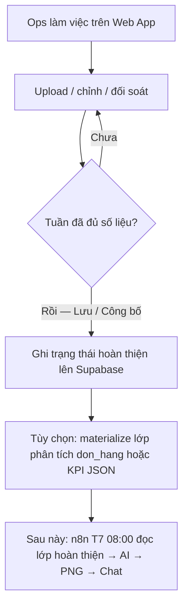

# AI Ops Kho HCM — Webapp-first foundation (trước n8n/AI)

## Problem Frame

Tài liệu thiết kế `Bao_Cao_Thiet_Ke_He_Thong_AI_Operations_Kho_HCM.md` mô tả đích đến: KPI tuần → LLM → PNG → Group Chat lúc 08:00 Thứ 7, với n8n đọc Supabase.

Thực tế vận hành CPC1HN: **số liệu phải được làm đủ trên Web App** (upload tuần, đối soát, lưu báo cáo) rồi mới coi là nguồn tin cậy trên Supabase. Không thể (và không nên) để n8n/SQL tưởng tượng bảng `don_hang` độc lập trong khi app vẫn là nơi hoàn thiện số liệu.

Đồng thời schema hiện tại sau migrate (`report_weeks`, `sheet_reports`, `tongdon_reports`, carrier, Storage) **chưa có** `don_hang` như tài liệu. Vì vậy bước tiếp theo là **nền tảng webapp → Supabase “tuần đã hoàn thiện”**, rồi mới materialize đơn vị phân tích / AI.

## User Flow

## Requirements

**Nguyên tắc nguồn sự thật**
- R1. **Web App là nơi hoàn thiện số liệu.** AI/n8n chỉ được tiêu thụ dữ liệu đã được ops xác nhận hoàn thiện trên app (không lấy bản đang sửa dở làm báo cáo Sếp).
- R2. Supabase lưu kết quả làm việc của Web App (đã là hướng cloud-first hiện tại). Không xây pipeline “n8n bỏ qua webapp” ở phase này.
- R3. Giữ nguyên công thức / quy tắc nghiệp vụ hiện có trong app (`CONTEXT.md`: weekId, 24h/48h/72h, carrier, partnerType). Phase này không đổi ý nghĩa KPI đã dùng trên dashboard.

**Định nghĩa “tuần đủ số liệu” (cổng hoàn thiện)**
- R4. Phải có định nghĩa sản phẩm rõ ràng cho **một chu kỳ báo cáo đã sẵn sàng**, tối thiểu gồm các điều kiện có thể kiểm tra trên Supabase (ví dụ: đã lưu sheet report Đơn C & Đơn DTP cho tuần đang chọn, và/hoặc đã lưu báo cáo Tổng đơn khóa weekKey). Chi tiết checklist khóa trong planning sau khi inventory UI hiện tại.
- R5. Chỉ khi cổng R4 đạt: hệ thống mới đánh dấu chu kỳ là `ready_for_analytics` (hoặc tương đương) trên Supabase.
- R6. Chu kỳ chưa đạt cổng: vẫn xem/sửa trên Web App bình thường; **không** đưa vào job AI/chat.

**Lớp phân tích (sau cổng hoàn thiện)**
- R7. Phase foundation cho phép **một** trong hai hướng kỹ thuật (chọn lúc plan, không chặn product):
  - **7a.** Materialize bảng đơn vị phân tích kiểu `don_hang` (hoặc tên tương đương) **từ** dữ liệu tuần/báo cáo đã hoàn thiện trên app; hoặc
  - **7b.** Materialize **KPI JSON tuần** (đủ field SLA/WoW/Hoàn/Tồn theo tài liệu AI) từ snapshot đã lưu, chưa cần bảng đơn từng dòng.
- R8. Không copy nguyên stored procedure mẫu trong tài liệu thiết kế nếu nó giả định bảng `don_hang` / cột chưa tồn tại. Mọi SQL/API analytics phải map từ schema thật sau migrate.

**Phạm vi phase này vs phase sau**
- R9. **In scope now:** cổng hoàn thiện trên Web App + ghi nhận trên Supabase + (nếu trong cùng epic) materialize lớp phân tích tối thiểu phục vụ KPI.
- R10. **Out of scope now:** Schedule n8n Thứ 7, gọi Gemini/OpenAI, render PNG, gửi Telegram/Zalo — đó là phase tiếp theo **sau khi** R4–R5 ổn định trên production.
- R11. Tài liệu thiết kế AI Ops vẫn là **đích hướng**; phase này là **nền bắt buộc** để tài liệu đó khớp dữ liệu thật.

**Vận hành & cutover**
- R12. Ưu tiên hoàn tất cutover Supabase Web App (env Vercel, user login, QA đa máy) trước khi mở rộng schema analytics — tránh xây AI trên môi trường chưa ổn định.
- R13. Shared org: dữ liệu hoàn thiện vẫn dùng chung cho mọi user authenticated (như quyết định migrate).

## Success Criteria

- Ops mô tả được: “Thế nào là tuần đã xong trên webapp” và hệ thống phản ánh đúng trạng thái đó trên Supabase.
- Không có đường tắt để AI/n8n đọc dữ liệu chưa hoàn thiện như nguồn chính thức.
- Có lớp dữ liệu analytics (đơn hoặc KPI JSON) sinh ra **chỉ** từ chu kỳ đã hoàn thiện.
- Plan AI Ops (n8n/LLM/PNG) có thể viết tiếp mà không phải giả định bảng ảo.

## Scope Boundaries

- Không triển khai bot chat / PNG / LLM trong phase này.
- Không thay UI báo cáo lớn hay đổi công thức SLA hiện có chỉ để “giống slide”.
- Không yêu cầu Vercel Cron thay n8n (n8n vẫn là orchestrator tương lai như tài liệu).
- Không backfill analytics từ dữ liệu nửa vời; backfill chỉ từ chu kỳ đã thỏa cổng hoàn thiện (nếu có).

## Key Decisions

- **Webapp-first, rồi analytics:** khớp cách anh vận hành (“có số liệu hết trên web rồi mới lên / dùng Supabase cho AI”).
- **Không làm `don_hang` độc lập trước webapp:** tránh lệch tài liệu thiết kế với thực tế app.
- **Cổng `ready_for_analytics`:** tách “đang làm” vs “đã chốt”.
- **AI/n8n = phase sau:** giảm rủi ro sau vừa migrate Supabase.
- **7a vs 7b để planning chọn:** product chỉ bắt buộc có lớp analytics sau cổng; hình dạng bảng đơn vs KPI JSON là quyết định kỹ thuật.

## Alternatives Considered

| Hướng | Vì sao không chọn làm mặc định ngay |
|---|---|
| Copy SQL `don_hang` + n8n như tài liệu | Schema chưa có; bỏ qua cổng hoàn thiện webapp |
| Chỉ AI đọc thẳng `tongdon_reports` không có cổng | Dễ gửi Sếp bản chưa khóa / thiếu kênh |
| Làm full n8n+PNG+AI ngay | Production webapp/Supabase cutover chưa xong |

## Dependencies / Assumptions

- Cutover Supabase Web App **đã xong** trên Vercel (login user Supabase thành công).
- Ops tiếp tục quy trình lưu báo cáo trên các tab hiện có (Đơn C/DTP, Tổng đơn, …).
- Tài liệu AI Ops gốc vẫn là tham chiếu KPI + prompt + lịch T7 08:00 cho phase sau.

## Outstanding Questions

### Resolve Before Planning

_(trống)_

### Deferred to Planning

- [Affects R4][Needs research] Checklist cụ thể — **đã khóa trong plan 003** (sheet C+DTP + tongdon; TMĐT soft).
- [Affects R7][Technical] **Đã chọn 7b KPI JSON** trong plan 003; `don_hang` để epic sau.
- [Affects R5][Technical] Bảng `reporting_cycles` + `analytics_week_packages` — chi tiết trong plan.
- [Affects R10][Technical] Hợp đồng JSON — Unit 5 của plan.

## Next Steps

→ Foundation delivered by plan `docs/plans/2026-08-09-003-feat-webapp-first-analytics-foundation-plan.md`: explicit publication, `reporting_cycles`, and KPI JSON package 7b.  
→ Read `docs/contracts/2026-08-09-weekly-kpi-package.md` before planning a future consumer.  
→ Only after production QA, plan n8n + AI + PNG as a separate epic.
