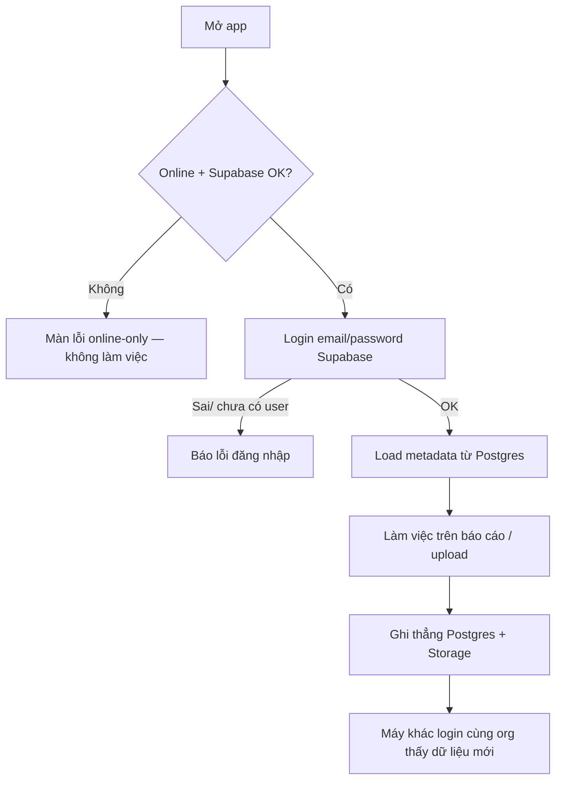

# Full migration: Firebase → Supabase

## Problem Frame

Ứng dụng CPC1HN hiện phụ thuộc **Firebase Auth + Firestore `kvstore`** (`src/firebase.js`, `src/cloudSync.js`) để đăng nhập và đồng bộ localStorage đa máy. Sau khi đưa config Firebase sang env (Snyk), production Vercel thiếu `VITE_FIREBASE_*` và đang downtime.

Anh đã chọn **không vá Firebase trên Vercel**, chấp nhận downtime, và chuyển **full stack auth + data sang Supabase**: Auth email/password, **schema relational**, **cloud-first**, **online-only**, migrate toàn bộ dữ liệu Firestore, kho **shared org** (mọi user login thấy cùng dữ liệu), file Excel tuần nằm trên **Supabase Storage** kèm metadata DB.

Đây là thay đổi nền tảng — không chỉ đổi SDK login.

## User Flow

## Requirements

**Cutover & phạm vi**
- R1. Thay **toàn bộ** Firebase Auth và Firestore bằng Supabase Auth + Postgres + Storage trong một cutover. Gỡ dependency `firebase` khỏi app sau khi go-live.
- R2. **Không** vá / phụ thuộc lại Firebase env trên Vercel để “chữa cháy”; production chỉ trở lại khi Supabase cutover xong (downtime đã chấp nhận).
- R3. Giữ nguyên công thức báo cáo, quy tắc phân loại đơn/carrier, `weekId` semantics, và UX các tab báo cáo ở mức hành vi nghiệp vụ — đổi lớp persistence, không đổi business rules (`CONTEXT.md`).

**Auth**
- R4. Đăng nhập **email/password** qua Supabase Auth; UI login giữ ngôn ngữ visual CPC1HN hiện có.
- R5. Tài khoản vận hành được **tạo lại thủ công** trên Supabase (password mới). Không yêu cầu import password hash từ Firebase.
- R6. Session: user phải đăng nhập mới dùng app; logout xoá session Supabase sạch.

**Data model & quyền**
- R7. Dữ liệu là **shared org store**: mọi user đã authenticated được đọc/ghi cùng tập dữ liệu vận hành (tương đương rules Firebase cũ `auth != null`). Không tách kho theo `auth.uid()` ở v1.
- R8. Schema **relational** (không port 1:1 collection `kvstore`). Planning phải map các nhóm localStorage hiện có sang bảng/metadata rõ ràng, tối thiểu gồm:
  - tuần Đơn C / Đơn DTP (metadata + active week)
  - sheet reports đã lưu
  - báo cáo Tổng đơn đã lưu
  - báo cáo TMĐT đã lưu
  - carrier weeks / hold weeks / excludes / notes
  - các override/field nhập tay gắn `weekId`
- R9. **File Excel / dump dòng chi tiết** của tuần và carrier: lưu trên **Supabase Storage**; Postgres chỉ giữ metadata (id, label, type, paths, timestamps, frozen aggregates khi có). App tải file từ Storage khi cần xem/tính tuần đó.
- R10. Bỏ monkey-patch `localStorage` → cloud (`cloudSync.js` kiểu hiện tại). App **cloud-first**: đọc/ghi Supabase là nguồn sự thật.

**Runtime hành vi**
- R11. **Online-only**: mất mạng hoặc Supabase lỗi → không cho làm việc; hiện trạng thái lỗi tiếng Việt rõ (không im lặng fallback local như Firebase hydrate cũ).
- R12. Không dùng localStorage làm nguồn sự thật sau cutover. Cache trình duyệt nếu có chỉ là tối ưu tạm, phải invalidate theo dữ liệu cloud; không “máy A sửa local, máy B không thấy”.

**Migration**
- R13. **Migrate một lần** toàn bộ dữ liệu đang có trong Firestore `kvstore` sang schema Supabase + Storage trước/go-live, sao cho sau đăng nhập user thấy tuần/báo cáo đã có (không fresh-empty).
- R14. Migration phải xử lý document chunked của Firestore và các key lớn; kiểm chứng số lượng key/bảng chính trước khi cắt Firebase.
- R15. Có checklist cutover: tạo project Supabase, schema + RLS, Storage buckets, tạo user, chạy migrate, set `VITE_SUPABASE_URL` / `VITE_SUPABASE_ANON_KEY` trên Vercel, deploy, xác nhận login + sync đa máy, rồi gỡ Firebase.

**Bảo mật & cấu hình**
- R16. Dùng env Vite cho Supabase (`VITE_SUPABASE_URL`, `VITE_SUPABASE_ANON_KEY`); thiếu env → màn cấu hình rõ, không white-screen/`invalid-api-key` kiểu cứng.
- R17. RLS Postgres + Storage policies: cho phép user authenticated truy cập dữ liệu org shared theo R7; chặn anon.
- R18. Không hardcode secret/service role trong frontend. Mọi thao tác client dùng anon key + RLS; script migrate một lần có thể dùng service role **offline/local**, không ship vào bundle web.

## Success Criteria

- User tạo trên Supabase đăng nhập được trên production sau deploy.
- Dữ liệu đã migrate: tuần/báo cáo/carrier chính có mặt; máy thứ hai login cùng org thấy cùng dữ liệu sau khi máy một ghi.
- Mất mạng → không vào được workspace (đúng online-only), có thông báo rõ.
- Không còn import/`firebase` trong runtime app; HomeBrief và báo cáo vẫn hoạt động trên nguồn Supabase.
- Vercel chỉ cần env Supabase (không cần `VITE_FIREBASE_*`).

## Scope Boundaries

- Không giữ dual-run Firebase + Supabase lâu dài sau go-live.
- Không xây org/role/admin UI phức tạp ở v1 (shared store đơn giản).
- Không đổi công thức 24h/48h/72h, partnerType, carrier rules, n8n payload nghiệp vụ.
- Không làm offline queue / sync conflict UI.
- Không normalize “đẹp tuyệt đối” mọi field lịch sử nếu không cần cho hành vi hiện tại — ưu tiên map đủ để app chạy và migrate được.
- Không vá production bằng hardcode lại Firebase API key.

## Key Decisions

- **Full Supabase** thay vì chỉ Auth hoặc vá Firebase env.
- **Downtime chấp nhận** đến cutover.
- **Migrate toàn bộ** `kvstore`, không fresh start.
- **Shared org** giống quyền Firebase cũ.
- **Relational + cloud-first + online-only**.
- **Tạo lại user** email/password trên Supabase.
- **Excel/chi tiết tuần → Storage**; metadata/aggregates → Postgres.
- **Big-bang remove Firebase** tại go-live.

## Alternatives Considered

| Hướng | Lý do không chọn |
|---|---|
| Vá `VITE_FIREBASE_*` trên Vercel | Anh chọn downtime + đổi backend |
| Chỉ Supabase Auth, giữ Firestore | Hai hệ, auth/rules phức tạp |
| Giữ `kvstore` 1:1 trên Postgres | Anh chọn relational |
| Local-first / read-only cache | Anh chọn cloud-first + online-only |
| Import password Firebase | Không cần; ít user, tạo lại đơn giản hơn |

## Dependencies / Assumptions

- Anh (hoặc ops) tạo Supabase project, tạo user, cung cấp URL + anon key cho Vercel.
- Có quyền export đọc Firestore `kvstore` của project `huyen-duong-cpc1hn` để migrate (service account / console export).
- Người dùng vận hành chấp nhận đặt password mới.
- File Excel lịch sử trong Firestore vẫn reconstruct được từ value/chunk để đẩy lên Storage.

## Outstanding Questions

### Resolve Before Planning

_(trống — quyết định product đã chốt)_

### Deferred to Planning

- [Affects R8][Needs research] Bảng Postgres cụ thể + map từng prefix localStorage / Firestore key.
- [Affects R9][Technical] Bucket naming, path convention, giới hạn dung lượng Storage, khi nào signed URL vs public authenticated.
- [Affects R13–R14][Needs research] Chiến lược export Firestore (script Node một lần) và đối soát số liệu sau migrate.
- [Affects R10][Technical] Refactor `useWeeklyData` / carrier / TongDon / Tmdt / HomeBrief sang API Supabase thay localStorage mà không đổi công thức.
- [Affects R11][Technical] Điểm chặn online check (bootstrap App vs từng thao tác ghi).
- [Affects R15][Technical] Thứ tự deploy GitHub Pages vs Vercel và cập nhật `CONTEXT.md`.

## Next Steps

→ Plan đã có: `docs/plans/2026-08-09-002-feat-full-supabase-migration-plan.md`  
→ Giao Codex/Claude Code implement theo plan (Units 1→8), không vá Firebase env.
