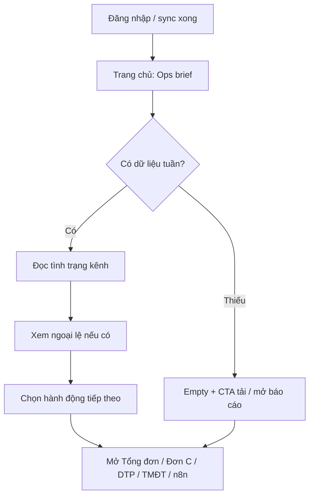

# Trang chủ — Calm Pharma-Ops Brief

## Problem Frame

Người dùng vận hành CPC1HN (nội bộ, chủ yếu desktop) mở app để kiểm tra **tuần báo cáo giao hàng** đang thế nào, rồi đi vào Đơn C / Đơn DTP / TMĐT / Tổng đơn hoặc xử lý việc còn thiếu.

Trang chủ hiện tại chỉ là **4 card shortcut** với copy giống nhau (“Xem báo cáo và danh sách đơn hàng”). Sidebar đã làm việc điều hướng, nên home **trùng menu**, để trống viewport lớn, và không trả lời câu hỏi đầu tiên: *“Tuần này các kênh đã sẵn sàng chưa?”*

Redesign biến Trang chủ thành **weekly ops brief** theo ngôn ngữ calm pharma-ops (warm canvas, CPC blue, trung tính, tin cậy) — không phải marketing hub, cũng không phải dark logistics command terminal.

## User Flow

## Requirements

**Vai trò trang**
- R1. Trang chủ là **weekly ops brief**, không chỉ directory card. Thứ tự đọc cố định: (1) tình trạng tuần hiện tại → (2) ngoại lệ cần xử lý → (3) hành động tiếp theo.
- R2. Ngôn ngữ thiết kế: **calm pharma-ops** — liên tục với login / visual system đã chốt (warm neutral canvas, white surfaces, CPC blue, typography/elevation hiện có). Cấm dark neon logistics aesthetic.

**Tình trạng tuần (khối chính)**
- R3. Home luôn nêu **ngữ cảnh tuần đang làm việc** (nhãn tuần / nguồn active week hiện có). Không thêm bộ chọn tuần toàn cục mới ở v1; ngữ cảnh đọc từ active week / bản ghi đã lưu sẵn của từng kênh.
- R4. Hiển thị **4 kênh** cố định: Tổng đơn, Giao hàng Đơn C, Giao hàng Đơn DTP, Đơn hàng Sàn TMĐT. Mỗi kênh là card/status có thể click để điều hướng đúng tab báo cáo.
- R5. Mỗi kênh thể hiện trạng thái vận hành tối thiểu, tái dùng dữ liệu đã có (localStorage / báo cáo đã lưu), **không tạo công thức nghiệp vụ mới**:
  - có / chưa có dữ liệu tuần
  - nhãn tuần đang active (nếu có)
  - đã lưu số liệu tuần hay chưa (với kênh có cơ chế lưu snapshot)
  - tối đa **một** số headline đã đóng băng sẵn nếu tồn tại (ví dụ mốc giao đã lưu); nếu không có snapshot thì không bịa số
- R6. Khi kênh chưa có dữ liệu tuần: vẫn hiện card, trạng thái empty rõ ràng kèm CTA hướng dẫn (“Tải file / Mở báo cáo”) — không ẩn kênh, không để số 0 giả.

**Ngoại lệ & hành động**
- R7. Khối ngoại lệ chỉ liệt kê việc vận hành còn thiếu / cần chú ý suy ra từ trạng thái dữ liệu hiện có (ví dụ: chưa upload, chưa lưu số liệu, thiếu kênh so với kỳ vọng tuần). Không xây exception engine, SLA realtime, hay map tracking mới.
- R8. Khối hành động tiếp theo gồm CTA ngắn tới việc hay làm sau khi đọc brief: mở báo cáo ưu tiên, upload khi thiếu data, và lối vào **Gửi lên n8n** khi phù hợp. Không nhồi KPI vào khối này.
- R9. Các card shortcut thuần túy hiện tại được **thay bằng** channel status cards (R4). Không giữ song song hai hàng card trùng nghĩa.

**Hành vi & ràng buộc**
- R10. Giữ nguyên auth, cloud sync, localStorage keys, công thức báo cáo, upload/parse, và luồng tab báo cáo hiện có. Home chỉ **đọc và điều hướng**.
- R11. Empty / loading / không có dữ liệu nào phải có copy tiếng Việt rõ, không blank đen, không chart rỗng trang trí.
- R12. Responsive: desktop-first; trên mobile brief xếp một cột, CTA đủ vùng chạm, không horizontal overflow cấp trang.
- R13. Sau khi auth/sync sẵn sàng, **landing mặc định là Trang chủ** (ops brief), không còn mặc định nhảy thẳng vào Đơn C.

## Success Criteria

- Người dùng nhìn Trang chủ ≤5 giây biết: đang làm tuần nào, kênh nào sẵn sàng / còn thiếu, và bước tiếp theo là gì.
- Không còn cảm giác “home = copy của sidebar”.
- Visual khớp login / shell đã redesign; không lệch sang dark neon hoặc pastel KPI loạn màu.
- Không thay đổi số liệu nghiệp vụ hay storage contracts.

## Scope Boundaries

- Không thêm analytics/chart/map/realtime tracking mới trên home.
- Không thêm công thức KPI mới, AI insights, drag-drop widget, dark mode, hay role-based layout.
- Không redesign sâu các tab báo cáo trong scope này (chỉ điều hướng vào chúng).
- Không đổi Firebase / sync / auth.
- Visual system plan toàn app (`docs/plans/2026-08-09-001-refactor-dashboard-visual-system-plan.md`) vẫn là nguồn cho shell/tokens; brainstorm này **mở rộng hành vi product của home** vượt mức “restyle 4 navigation cards”.

## Key Decisions

- **Calm pharma-ops brief** thay vì directory premium hoặc logistics command density: đúng domain dược + logistics nội bộ, khớp brand đã chốt, đủ giá trị vận hành mà không phình scope.
- **Ưu tiên tình trạng tuần** trước ngoại lệ và CTA: câu hỏi đầu tiên của user ops là “tuần này thế nào?”.
- **Empty có hướng dẫn** thay vì ẩn kênh hoặc hiện 0 giả: thiếu data là tín hiệu vận hành, không phải noise cần giấu.
- **Không week picker toàn cục ở v1**: tránh invent model tuần chung khi mỗi kênh đang có active week riêng; home đọc ngữ cảnh hiện có.
- **Một headline số tối đa / kênh, chỉ khi đã đóng băng**: tránh home trở thành nơi tính lại báo cáo.
- **Thay nav cards bằng status cards**: bỏ trùng lặp với sidebar.
- **Default landing = Trang chủ**: brief chỉ có giá trị nếu user nhìn thấy sau đăng nhập; Đơn C vẫn một click từ sidebar/status card.

## Alternatives Considered

| Hướng | Vì sao không chọn làm mặc định |
|---|---|
| Directory premium (chỉ làm đẹp 4 card) | Không giải quyết việc home vô dụng so với sidebar |
| Logistics command density (nhiều KPI/queue) | Dễ vượt data sẵn có; rủi ro invent metric; nặng hơn nhu cầu báo cáo tuần |
| Dark neon logistics templates | Xung đột login / brand CPC1HN và ngôn ngữ pharma tin cậy |

## Dependencies / Assumptions

- Shell/tokens từ visual system plan (hoặc trạng thái shell hiện tại sau redesign) là nền để home kế thừa.
- Có thể suy trạng thái kênh từ storage hiện có (`weeks_*`, `activeWeek_*`, `sheet_reports_*`, dữ liệu TMĐT / `tongdon_reports`, v.v.) — chi tiết đọc/ghi thuộc planning.
- User chính là nhân sự vận hành nội bộ đã quen sidebar hiện tại.

## Outstanding Questions

### Resolve Before Planning

_(trống — product decisions đã chốt trong brainstorm)_

### Deferred to Planning

- [Affects R3–R5][Needs research] Mapping chính xác field/storage → status + headline cho từng kênh mà không đụng công thức.
- [Affects R7][Technical] Danh sách ngoại lệ cụ thể nào đủ tín hiệu / đủ rẻ để derive ở home mà không scan nặng.
- [Affects R2/R12][Technical] Cắt home thành component riêng vs giữ trong `src/App.jsx`; tái sử dụng primitive dashboard nào từ visual system plan.

## Next Steps

→ `/prompts:ce-plan` cho implementation planning, hoặc giao Codex implement theo requirements này nếu scope được coi là đủ rõ.
