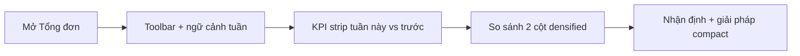

# Tổng đơn — No-scroll calm pharma-ops redesign

## Problem Frame

Tab **Tổng đơn** (`src/components/TongDonTab.jsx`) đã có đủ số liệu tuần này / tuần trước, KPI cards, chi tiết kênh, nhận định vận hành và giải pháp — nhưng **dàn dọc dài**, buộc scroll nhiều. Visual còn lệch Trang chủ (shadow card nặng, mật độ chữ cao, khoảng trống lớn).

Ops CPC1HN chủ yếu làm việc **desktop**. Mục tiêu: nhìn **một viewport** (không scroll trang chính) vẫn đọc được tình trạng tuần + so sánh + nhận định, đồng thời **đồng bộ ngôn ngữ thiết kế calm pharma-ops** của Trang chủ (`HomeBrief` + tokens trong `src/index.css`).

## User Flow

## Requirements

**Viewport / layout**
- R1. **Không scroll** vùng nội dung chính của Tổng đơn trên desktop chuẩn (~1366×768 trở lên, ưu tiên 1440×900 / 1920×1080). Toàn bộ khối báo cáo đã lưu (sau khi có snapshot) phải nằm trong một composition vừa viewport làm việc (dưới header app + breadcrumb + toolbar).
- R2. Sắp xếp lại thành **một composition** (không cảm giác “dashboard xếp chồng vô hạn”): toolbar gọn → KPI strip → so sánh tuần này|tuần trước → nhận định/giải pháp. Giảm padding/margin thừa; ưu tiên **chiều ngang** và mật độ có kiểm soát hơn chiều dọc.
- R3. Nếu nội dung nhận định/giải pháp quá dài: dùng **panel cuộn nội bộ nhỏ** (max-height cố định) hoặc **tabs / 2 cột** — không làm cả trang scroll. Không ẩn mất dữ liệu nghiệp vụ.
- R4. Màn hình chọn tuần / empty / chưa lưu: cũng không scroll vô nghĩa; giữ CTA rõ. Print / xuất ảnh / PDF vẫn dùng được (print CSS có thể cho phép nhiều trang — không bắt buộc no-scroll khi print).

**Design language (khớp Trang chủ)**
- R5. Dùng tokens hiện có: `--bg-page` / `--surface-canvas` `#f4f3ee`, surface trắng, CPC blue `#0e59bf`, typography/spacing kiểu `home-brief-*`. Cấm dark neon, glow, purple gradient AI-default, card shadow nặng kiểu “dashboard SaaS”.
- R6. Section heading theo nhịp Home: eyebrow/step nhỏ + title ngắn + một câu phụ (nếu cần). Status / delta dùng tone sẵn (`ready` / attention / missing hoặc xanh/đỏ semantic hiện có) — không invent palette mới.
- R7. Card chỉ khi cần khung tương tác/đọc; bỏ viền/shadow thừa nếu không giúp đọc. Toolbar action (Công bố, Upload, Xuất…) restyle cho khớp shell/home, **không đổi hành vi**.

**Giữ nguyên nghiệp vụ**
- R8. Không đổi công thức KPI, `weekKey`, lưu/xóa snapshot, Công bố cho phân tích, upload tuần, xuất ảnh/PDF, editable title/fields.
- R9. Không đổi storage / Supabase contracts / `opsStore` keys.
- R10. Copy tiếng Việt; desktop-first. Mobile: xếp cột, **được phép scroll** (R1 chỉ cứng trên desktop).

## Success Criteria

- Desktop với snapshot đã lưu: **không cần scroll trang** để thấy KPI + so sánh + nhận định/giải pháp (hoặc phần còn lại chỉ scroll trong panel nội bộ đã khoanh).
- Nhìn Tổng đơn nhận ra cùng họ visual với Trang chủ trong ≤3 giây.
- Số liệu và hành động hiện có không regress; tests liên quan TongDon/publish vẫn pass hoặc được cập nhật cho UI mới.

## Scope Boundaries

- Không redesign Đơn C / DTP / TMĐT / Home trong epic này.
- Không thêm chart mới, AI copy, hay KPI formula mới.
- Không đổi auth / cloud sync.
- Không bắt buộc pixel-perfect “zero overflow” trên laptop rất thấp (<768 chiều cao) — khi đó panel nội bộ cuộn là chấp nhận được.

## Key Decisions

- **No-scroll trang** bằng **reflow + densify + panel nội bộ**, không cắt bỏ khối nhận định/giải pháp.
- **Calm pharma-ops** lấy từ Home tokens/patterns, không skin lại theo template logistics khác.
- **Print/export** tách khỏi ràng buộc no-scroll viewport.

## Next Steps

1. Codex implement redesign theo R1–R10 trên `TongDonTab.jsx` + CSS liên quan.
2. Visual QA desktop 1440 và 1920; smoke publish/export.
3. (Optional) ce-plan chỉ nếu Codex cần tách unit lớn — mặc định implement trực tiếp từ doc này.
