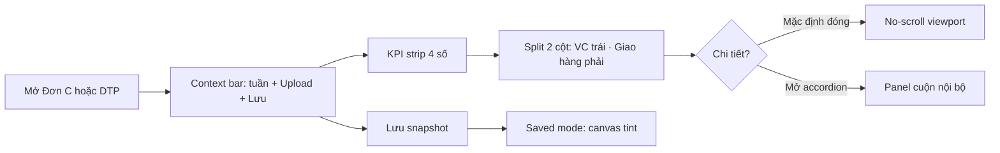

# Giao hàng Đơn C / Đơn DTP — No-scroll calm pharma-ops redesign

## Problem Frame

Tab **Giao hàng Đơn C** và **Giao hàng Đơn DTP** (`SheetTab.jsx`, `type="donC" | "donDTP"`) là mặt làm việc hàng tuần: chọn tuần → upload Excel → đối soát đối tác VC (VTP/SPX/trực tiếp/chành) → thống kê giao hàng → chỉnh VC → lưu snapshot.

UI hiện tại:
- Scroll dài, card màu rải rác (`ThongKeDoiTac`, `ThongKeGiaoHang`)
- Toolbar thiếu hierarchy (toggle view, tuần, upload, lưu rải rác)
- Lệch ngôn ngữ **calm pharma-ops** của Trang chủ (`HomeBrief`) và Tổng đơn (`TongDonTab`)

Ops CPC1HN chủ yếu desktop. Mục tiêu: **một viewport** (no-scroll trang) vẫn đọc được KPI + đối tác VC + thống kê giao hàng; chi tiết đơn hàng progressive disclosure; **Đơn C và Đơn DTP cùng composition** (DTP thêm hold VTP).

## User Flow



## Key Decisions

| # | Quyết định |
|---|------------|
| Hướng | Calm pharma-ops + no-scroll desktop + progressive disclosure |
| Phạm vi | **Đơn C + DTP** cùng một spec / composition |
| Layout | Split 2 cột: trái KPI groups + đối tác VC; phải thống kê giao hàng |
| Chi tiết | Accordion full-width dưới cùng, **đóng mặc định**, panel cuộn nội bộ |
| DTP hold | Cột trái, trong panel VC, **ngay dưới Viettel Post** |
| Toolbar | Một context bar: tuần trái; Upload (secondary) + Lưu (primary) phải; xuất/in/ xóa trong overflow |
| Saved mode | Live = surface trắng; saved = `--surface-canvas` + border ready xanh nhẹ (giống Tổng đơn) |
| View toggle | **Bỏ** — một composition duy nhất (đã merge từ trước) |
| Triển khai | **Approach A:** shell + restyle surfaces một lần, giữ logic tính toán |

## Requirements

### Viewport / layout

- R1. **No-scroll trang** trên desktop chuẩn (≥1366×768, ưu tiên 1440×900 / 1920×1080): KPI strip + split 2 cột + accordion **đóng** nằm trong viewport dưới header app + breadcrumb + context bar.
- R2. Split **~45% trái / ~55% phải**: trái = đối tác VC; phải = thống kê giao hàng. Cột phải được phép `overflow-y: auto` nội bộ nếu cao hơn viewport — **không** scroll cả trang.
- R3. Accordion **"Danh sách chi tiết đơn hàng"** full-width dưới split: mặc định đóng; mở → panel `max-height ~240px` (1440+) hoặc `~35vh` (laptop thấp), scroll nội bộ; `DataTable` horizontal scroll trong panel.
- R4. Laptop chiều cao thấp (<768px): tăng scroll nội bộ cột/panel — vẫn ưu tiên không scroll `dashboard-main`.
- R5. Mobile (<1024px): một cột (KPI → VC → giao hàng → accordion); **được phép scroll trang** (R1 chỉ cứng desktop).
- R6. Empty (chưa có tuần): chỉ upload zone + copy hướng dẫn — không split.

### Toolbar & actions

- R7. **Context bar** một hàng: trái = eyebrow loại báo cáo + `WeekSelector` restyle; phải = Upload (secondary) + **Lưu số liệu tuần này** (primary) + menu overflow (`⋮`).
- R8. Overflow: Xuất ảnh, In, Xóa tuần (destructive + confirm), Relink carrier khi cần — không tranh primary với Lưu.
- R9. Badge trạng thái: **Đã lưu** (pill xanh), **Pending clear** (amber + countdown + Hoàn tác) — giữ hành vi hiện tại.
- R10. Saved-only (không Excel gốc): ẩn Upload; Lưu → "Cập nhật lại" hoặc disabled nếu frozen; Xuất/In vẫn có.
- R11. **Bỏ** toggle view cũ (`Danh sách` / `Thống kê` / `Đối tác VC`).

### KPI strip

- R12. Bốn KPI compact full-width dưới context bar: Tổng kiện, Đã giao, Tỷ lệ giao, Chưa giao/ngoại lệ — lấy từ logic hiện có, **không công thức mới**.
- R13. Presentation kiểu `tongdon-kpi`: label nhỏ + số lớn, neutral surface — không card màu riêng từng ô.

### Cột trái — Đối tác VC

- R14. Restyle `ThongKeDoiTac`: trực tiếp 24/48/72/khác, chành xe, VTP, SPX — compact rows, progressive disclosure **"Chi tiết"** per group (mặc định thu gọn).
- R15. **DTP only:** block **Chờ lấy** (hold VTP) ngay dưới Viettel Post — số hold, thiếu file, unmatched highlight (giữ logic hold hiện tại).
- R16. Frozen carrier (tuần đã lưu, file VTP/SPX xóa): tag "Đóng băng", số tĩnh, relink qua overflow nếu cần.

### Cột phải — Thống kê giao hàng

- R17. Restyle `ThongKeGiaoHang`: stat grid neutral, phân loại KH chưa giao (BV/NT/ONL hoặc NT/PK/ONL), override nhập tay, so sánh carrier file — giữ logic và storage keys.
- R18. Bỏ rainbow pastel box lớn (`bg-green-50 border-green-200` full section); status qua badge/chip nhỏ.

### Live vs saved visual

- R19. **Live:** surface trắng, border neutral.
- R20. **Saved:** wrapper `sheet-tab.is-saved-report` — canvas tint + border `--status-ready` + eyebrow "Bản đã lưu".

### Design language

- R21. Tokens: `--surface-canvas`, `--surface-subtle`, CPC blue `#0e59bf`, patterns `home-brief-*` / `tongdon-*`. CSS namespace **`sheet-tab-*`** trong `index.css`.
- R22. Cấm: dark neon, glow, purple gradient AI-default, card shadow nặng dashboard SaaS.
- R23. No-scroll lock: `.sheet-tab.is-active-report` + `dashboard-main:has(.sheet-tab.is-active-report) { overflow: hidden }` (mirror `tongdon-tab`).

### Print / export

- R24. `report-export-surface` bọc KPI + 2 cột; xuất ảnh auto-expand accordion; print ẩn shell/actions — nội dung nhiều trang OK khi print.
- R25. Giữ `toPng` background trắng, pixelRatio 2.

### Giữ nguyên nghiệp vụ (immutable)

- R26. Không đổi: `deliveryBucket`, `partnerType`, carrier matching, rule Tân Thịnh 24h, hold chỉ DTP, pickup fail SPX, `displayWeeks` merge, pending clear/undo, rename/delete saved-only weeks.
- R27. Không đổi storage / Supabase contracts / `opsStore` keys.
- R28. Copy tiếng Việt; desktop-first.

## Success Criteria

- Desktop 1440×900 với tuần có data + accordion đóng: **không scroll trang** để thấy KPI + 2 cột.
- Nhìn ≤3 giây nhận ra cùng họ visual với Trang chủ / Tổng đơn.
- Fixture Đơn C và DTP: **số liệu không đổi** trước/sau redesign (characterization tests).
- DTP: hold block dưới VTP; unmatched đỏ + cột Ghi chú vẫn hoạt động.
- Saved mode: canvas tint + border ready rõ ràng.
- Export/print đầy đủ; mobile một cột scroll OK.
- Vitest liên quan pass hoặc cập nhật có chủ đích.

## Scope Boundaries

### In scope

- `SheetTab.jsx`, `SheetReportPanel.jsx`, `ThongKeDoiTac.jsx`, `ThongKeGiaoHang.jsx`, `WeekSelector.jsx`, `DataTable.jsx` (compact trong accordion), `index.css` (`sheet-tab-*`), tests.

### Out of scope

- TMĐT, Trang chủ, Tổng đơn (đã redesign)
- Analytics / Công bố cho phân tích
- KPI formula mới, chart, AI copy
- Auth / Supabase schema
- Shell sidebar/header redesign (trừ dùng chung tokens)

## Files

| File | Thay đổi |
|------|----------|
| `src/components/SheetTab.jsx` | Composition mới, bỏ view toggle |
| `src/components/SheetReportPanel.jsx` | Actions lên context bar, export surface |
| `src/components/ThongKeDoiTac.jsx` | Restyle + progressive disclosure |
| `src/components/ThongKeGiaoHang.jsx` | Restyle |
| `src/components/WeekSelector.jsx` | Restyle + keyboard a11y |
| `src/components/DataTable.jsx` | Compact variant trong accordion |
| `src/index.css` | Namespace `sheet-tab-*` |
| `src/components/__tests__/SheetTab.test.jsx` | Characterization Đơn C + DTP |
| `src/components/__tests__/DeliveryReportPresentation.test.jsx` | (new) fixture counts unchanged |

## Composition Reference (desktop)

```
┌─ Context bar ─────────────────────────────────────────┐
│ Giao hàng Đơn C · Tuần 32 ▾          [Upload] [Lưu] ⋮│
├─ [Pending clear banner — nếu có] ─────────────────────┤
├─ KPI strip (4 số) ────────────────────────────────────┤
├──────────────────────┬────────────────────────────────┤
│ Cột trái (~45%)      │ Cột phải (~55%)                │
│ · Trực tiếp 24/48/72 │ · Thống kê giao hàng           │
│ · Chành xe           │ · Phân loại KH chưa giao       │
│ · VTP / SPX          │ · Override nhập tay            │
│ · [DTP] Hold VTP     │ · (scroll nội bộ nếu cần)      │
├─ Accordion "Danh sách chi tiết" (đóng mặc định) ──────┤
│  └─ panel max-height, scroll nội bộ                   │
└───────────────────────────────────────────────────────┘
```

## Next Steps

1. User review spec này.
2. Invoke **writing-plans** skill → implementation plan (hoặc prompt Codex trực tiếp nếu anh prefer).
3. Codex implement R1–R28; Cursor audit cổng cuối.
4. Visual QA desktop 1440/1920; smoke Đơn C + DTP save/export; DTP hold path.
