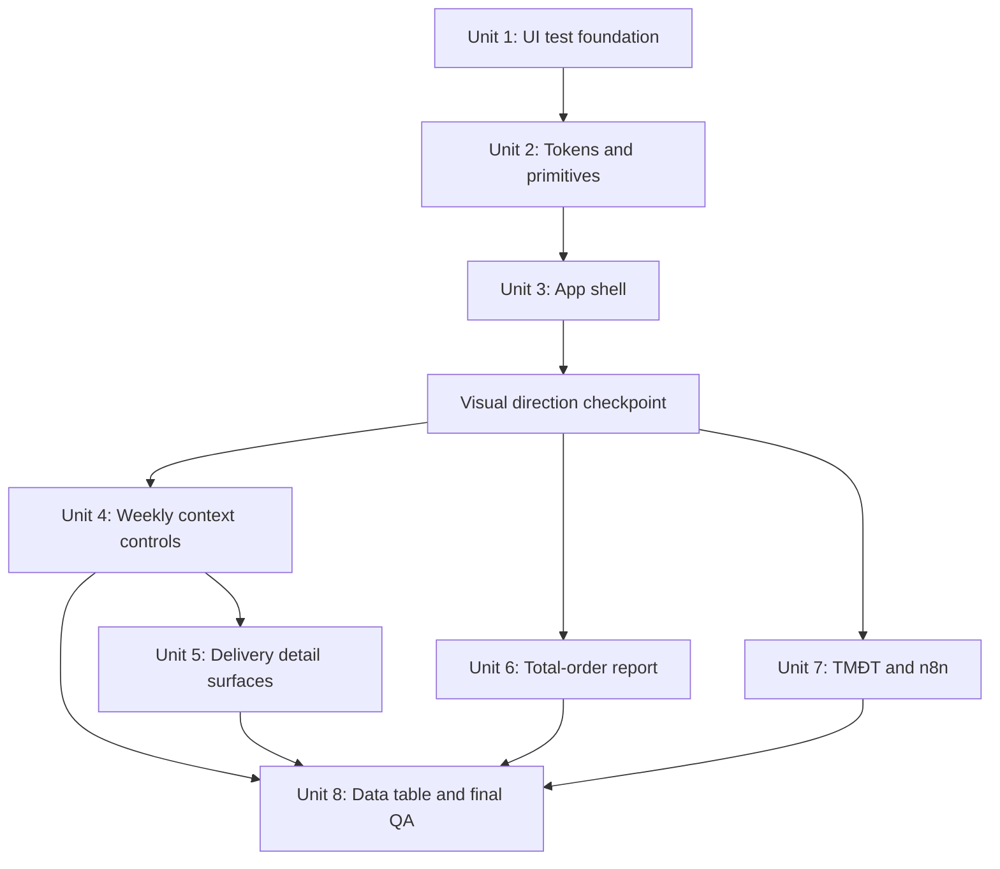

# refactor: Redesign CPC1HN delivery dashboard

## Overview

Redesign the authenticated CPC1HN delivery-reporting interface into one coherent operations workspace that carries forward the visual spirit of the completed login page: official CPC1HN branding, a warm neutral canvas, crisp white surfaces, restrained blue emphasis, calm typography, and soft depth.

This is a presentation and interaction refactor. Existing calculations, Firebase authentication and synchronization, localStorage keys, weekly report semantics, uploads, saved snapshots, export behavior, carrier matching, and business rules remain unchanged.

## Problem Frame

The current dashboard is functional and its information architecture is understandable, but the screenshot at a 2048px-wide viewport exposes a fragmented visual system:

- The dark navy shell and placeholder CPC mark do not match the official logo, CPC blue, warm canvas, and quieter styling now established by `src/components/Login.jsx` and `src/index.css`.
- Nearly every KPI and status is presented as a different pastel card. Brand color, status color, and content grouping therefore compete at the same visual level.
- The very wide content area stretches KPI rows and report sections, while small labels, shallow controls, and tight vertical spacing make the page feel simultaneously empty and crowded.
- Breadcrumbs, page title, week selection, upload, save, export, print, and recovery actions are distributed across several thin bars without a stable action hierarchy.
- Controls and states are implemented independently across large components, producing inconsistent button sizes, focus states, radii, shadows, and semantic colors.
- Custom dropdowns, clickable upload containers, modal overlays, charts, and icon-only actions do not yet have a complete keyboard, focus-management, or screen-reader contract.
- The detailed table requires special horizontal scrolling, but its fixed bottom scrollbar spans the viewport instead of respecting the content shell.

The redesign should improve clarity and confidence for an operations user who repeatedly scans weekly delivery health, investigates exceptions, uploads source files, saves snapshots, and exports reports. It should not turn the app into a decorative marketing dashboard or reduce the density needed for real work.

## Planning Bootstrap

- **Problem:** The authenticated application lacks visual continuity with the new login and does not prioritize operational decisions clearly.
- **Intended behavior:** Preserve every existing workflow while unifying navigation, page framing, actions, cards, forms, tables, feedback, and responsive behavior.
- **Primary users:** Internal CPC1HN operations staff working mainly on desktop, with tablet and mobile access for review and light actions.
- **Non-goal:** Recalculate metrics, change source matching, migrate storage, redesign authentication logic, or add new business features.
- **Success criterion:** A user can identify the current page and reporting week, read the most important metrics and exceptions, and find the next action without interpreting several competing visual systems.

## Requirements Trace

- **R1 — Login continuity:** Use the official CPC1HN logo and the login's warm-neutral, white-surface, black-text, CPC-blue visual language throughout the authenticated shell.
- **R2 — Operational hierarchy:** Separate brand color, semantic status color, and structural surfaces so the most important metric, exception, and action are immediately scannable.
- **R3 — Behavior preservation:** Preserve all calculations, storage keys, Firebase flows, uploads, report save/delete/undo behavior, filtering, editing, printing, and image export.
- **R4 — Consistent interaction system:** Standardize buttons, fields, segmented controls, dropdowns, cards, section headings, status indicators, alerts, empty states, and loading states.
- **R5 — Responsive workspace:** Support wide desktop, laptop, tablet, and 390px mobile without page-level horizontal overflow; data tables may scroll inside their own bounded region.
- **R6 — Accessibility:** Provide visible focus, semantic controls, accessible names, logical headings, keyboard-operable navigation and popovers, modal focus management, non-color status cues, reduced motion, and readable contrast.
- **R7 — Report/export integrity:** Keep exportable and printable report content visually complete and independent from shell controls, mobile drawers, and sticky toolbars.
- **R8 — Incremental delivery:** Land the redesign in dependency-ordered slices so visual foundations and shell behavior are verified before large report surfaces change.

## Scope Boundaries

### In scope

- Authenticated app shell, desktop sidebar, mobile navigation, header, breadcrumbs, user/sync/logout area, and auth checking/syncing states.
- Shared visual tokens and the smallest useful set of reusable dashboard primitives.
- Home navigation cards; report page headers; view/week/upload/action toolbars.
- Đơn C, Đơn DTP, Tổng đơn, TMĐT, carrier statistics, detailed tables, n8n form, alerts, dialogs, empty/loading/error states, and print/export presentation.
- Responsive and accessibility behavior directly connected to these surfaces.
- Focused UI test infrastructure and browser evidence needed to protect critical interactions.

### Out of scope

- Firebase configuration, Firestore rules, authentication providers, or authorization roles.
- `src/cloudSync.js`, report formulas, carrier classification, date parsing, SheetJS parsing logic, or localStorage key contracts.
- New analytics, new charts, new filters, dark mode, notification systems, routing libraries, or backend changes.
- Rewriting the large report modules for general code cleanliness unless a small presentational extraction is required to apply the visual system safely.
- Changing the already-approved login card, apart from consuming shared tokens that remain visually equivalent.

## Audit Summary

| Dimension | Current assessment | Redesign target |
|---|---|---|
| Brand continuity | Dark shell and placeholder mark conflict with the completed login | Official logo, CPC blue, warm canvas, and the same typography/elevation language |
| Information hierarchy | Many colored boxes compete; page context and actions are thin | One page title/context band, four primary KPIs, exception-first sections, progressive detail |
| Density | Wide cards stretch while text and controls remain small | Bounded reading widths, compact data surfaces, deliberate 12/16/24/32 rhythm |
| Color semantics | Brand, comparison periods, channels, and statuses overlap | CPC blue for brand/action; green/amber/red for status; current/previous comparison has one stable convention |
| Interaction consistency | Buttons, fields, popovers, modals, and feedback vary by component | Shared control heights, radii, focus rings, disabled/loading states, and action hierarchy |
| Responsive behavior | Some grids collapse, but shell, actions, popovers, and tables are desktop-led | Desktop sidebar, tablet compact rail, mobile drawer; bounded table scroll and wrapped actions |
| Accessibility | Lucide icons and labels help, but keyboard/focus/dialog/chart contracts are incomplete | WCAG-oriented controls, navigation, dialogs, status cues, chart summaries, and reduced motion |

### Strengths to preserve

- The sidebar grouping matches the user's reporting mental model.
- Existing components already expose meaningful page and section boundaries.
- Lucide is used consistently, so no new icon system is needed.
- The app already contains real loading, empty, success, error, saved, pending-clear, read-only, and export states that can be restyled rather than reinvented.
- Tổng đơn already separates comparison, operational insight, verdict, and next actions; the redesign should clarify this sequence instead of flattening it.

## Context & Research

### Technology & Infrastructure

- React 19.2 and Vite 8 with Tailwind CSS 4 and a shared stylesheet in `src/index.css`.
- Firebase Auth and Firestore-backed localStorage synchronization wrap the authenticated app in `src/App.jsx`.
- Recharts provides the TMĐT chart; Lucide provides icons; html-to-image and browser print support report export.
- This is a single frontend application, not a monorepo. Deployment supports both GitHub Pages and Vercel through the conditional base in `vite.config.js`.
- There is currently no component-test runner; `npm test` runs a Node test focused on the SheetJS security contract.

### Relevant Code and Patterns

- `src/components/Login.jsx` and the login section of `src/index.css` are the visual source of truth for brand color, official logo treatment, typography, control radius, focus ring, and soft shadow.
- `src/App.jsx` owns authentication states, navigation configuration, sidebar state, breadcrumbs, and page switching. It is the correct boundary for the app shell.
- `src/components/SheetTab.jsx` composes week selection, uploads, statistics, saved reports, and the expandable detailed list for Đơn C/DTP.
- `src/components/TongDonTab.jsx` has the clearest existing report hierarchy but mixes presentation helpers with significant calculation and persistence logic; the redesign must avoid touching the latter.
- `src/components/DataTable.jsx` owns search, filters, pagination, resize, editable carrier cells, and synchronized scrollbars. Its interaction contracts must be characterized before visual changes.
- `src/components/TmdtTab.jsx`, `src/components/WeekSelector.jsx`, and `src/components/ExcelUpload.jsx` contain custom modal, popover, and drop-zone interactions that need explicit accessibility treatment.
- `src/components/SheetReportPanel.jsx`, `src/components/ThongKeGiaoHang.jsx`, `src/components/ThongKeDoiTac.jsx`, and `src/components/CarrierStats.jsx` repeat colored cards, action buttons, and section treatments that should consume shared presentation primitives.

### Institutional Learnings

- No `docs/solutions/` directory or critical-patterns document exists in this repository.
- `CONTEXT.md` is the local source of truth: weekly values must remain keyed by `weekId`, date parsing rules must not change, saved snapshots must remain stable, and destructive cleanup must retain confirmation or undo semantics.

### Design Guidance Applied

- Use a data-dense operations-dashboard pattern: high information visibility, restrained decoration, stable navigation, strong typography, visible filters, and accessible status colors.
- Keep charts secondary to exact numbers and provide textual/table alternatives.
- Use a 4/8px spacing basis, at least 44×44px targets for action buttons and input triggers, enlarged hit areas for precision controls such as column-resize handles, visible focus, and 150–250ms motion that respects `prefers-reduced-motion`.
- Reject the generic design-system suggestion to introduce Fira Sans/Fira Code. The existing login's Inter/system stack provides stronger product continuity and avoids a new external font dependency.

### External Research Decision

External web research is unnecessary for this plan. The task is fully grounded by the supplied production screenshot, the completed login implementation, repository patterns, and the local UI design guidance. Current framework or API behavior is not a planning uncertainty.

## Visual Direction: CPC Operations Workspace

### Visual thesis

A calm internal operations workspace: official CPC1HN identity, warm neutral canvas, clean white working surfaces, precise black/gray typography, and CPC blue reserved for orientation and primary action. Red appears through the official logo and only as a destructive/critical semantic accent elsewhere.

### Content plan

1. Persistent orientation: official logo, primary navigation, current page, user/sync state.
2. Page context: title, description/reporting period, and one clearly grouped action area.
3. Decision layer: four primary KPIs followed by exceptions requiring attention.
4. Analysis layer: comparison and channel details with consistent current/previous encoding.
5. Work layer: editable notes, source selection, tables, uploads, save/export, and recovery actions.

### Interaction plan

- The shell has only two navigation modes: a persistent 240–256px sidebar when the validated content breakpoint has enough room, and a dismissible drawer with scrim/focus return below it. Do not add a third icon-rail mode.
- Header actions are ordered primary, secondary, then destructive/recovery. Overflow is used when actions cannot fit rather than compressing labels below readable size.
- Week selection and upload sit in one context toolbar beneath the page title. They do not compete with save/export/print actions.
- Detailed lists and carrier reconciliation use progressive disclosure, but critical exceptions and counts remain visible without expansion.
- Status transitions use color plus icon/text; motion never changes layout bounds.

### Core tokens

| Role | Direction |
|---|---|
| Canvas | Warm `#F4F3EE`, inherited from login |
| Primary surface | White |
| Subtle surface | Warm/blue-neutral tint, not a new card color per metric |
| Brand/action | CPC blue `#0E59BF`; hover `#084796` |
| Primary text | `#0E0F12` |
| Secondary text | Existing neutral family, adjusted where needed for 4.5:1 contrast |
| Border | Warm light border aligned with login fields |
| Success/warning/danger | Dark readable semantic foreground plus very light tint; color never stands alone |
| Comparison periods | One stable current/previous pair reused in every report and chart |
| Radius | 10–12px controls; 14–16px primary surfaces; pills only for status/counts |
| Shadow | Soft login-style elevation only for floating/modal surfaces; most dashboard grouping uses borders |
| Type scale | 12, 14, 16, 20, 24/28px with sequential heading semantics |

### Directional layout sketch

> *This illustrates the intended approach and is directional guidance for review, not implementation specification. The implementing agent should treat it as context, not code to reproduce.*

```text
+----------------------+--------------------------------------------------+
| Official CPC1HN      | Page title + period             Primary actions |
|                      +--------------------------------------------------+
| Primary navigation   | Context toolbar: view | week | upload           |
|                      +--------------------------------------------------+
|                      | KPI summary: 4 calm, comparable metrics          |
|                      +--------------------------------------------------+
|                      | Exceptions / status summary                      |
| User + sync          +--------------------------------------------------+
| Logout               | Analysis / report / bounded data table           |
+----------------------+--------------------------------------------------+
```

On mobile, the left column becomes a drawer and the top row becomes a compact app bar. The content sequence remains unchanged.

## Key Technical Decisions

- **Extend the login token layer instead of inventing a second theme.** `src/index.css` becomes the semantic source for brand, surfaces, text, border, focus, control sizing, radius, elevation, and motion.
- **Use CSS semantic classes for shared component anatomy and Tailwind for local layout.** This mirrors the successful login implementation while keeping data-specific grids and responsive composition close to their components.
- **Create only small presentational primitives.** Buttons, page/section framing, KPI/status surfaces, and feedback states may be shared; calculation and persistence helpers remain in their current modules.
- **Use a light sidebar.** It provides direct continuity with the login and official logo, reduces the large dark block visible in the screenshot, and lets active CPC blue carry orientation without adding teal.
- **Do not make every number a card.** Primary KPIs receive surfaces; secondary values use rows, grouped panels, bars, or compact status cells.
- **Bound narrative reports but allow tables to use available width.** Tổng đơn and forms use a readable maximum width; detailed order/carrier tables expand within the content column and own their horizontal scroll.
- **Preserve current/previous semantics.** Existing green/orange comparison meaning stays consistent across Tổng đơn; semantic delivery states use separate accessible tones and labels.
- **Add a focused component-test layer rather than replace the existing Node test.** Keep `npm test` compatible with the SheetJS security test and add a separate UI test script/config for critical shell, popover, dialog, and table interactions.
- **Keep report capture isolated.** Export refs contain only report content and use explicit export/print surface tokens; sticky headers, drawers, and controls remain outside the capture.

## User Flows and State Coverage

1. **Authentication to workspace:** checking → logged out/login → cloud syncing → ready. Every state uses the shared brand canvas and communicates progress or recovery.
2. **Navigation:** user opens a top-level page or report child, sees the active state and page context, and can collapse/dismiss navigation without losing orientation.
3. **Đơn C/DTP weekly work:** no data/upload → select/rename/delete week → inspect statistics → expand details → save snapshot → pending-clear/undo → saved read-only report → export/print.
4. **Tổng đơn review:** choose current/previous sources → inspect KPI/comparison/insights → edit report text → save read-only snapshot → export/print or delete and choose again.
5. **Carrier investigation:** choose carrier/week → upload source/hold file → inspect status summary and reconciliation → filter unmatched/excluded details.
6. **TMĐT reporting:** inspect latest KPIs/trend/history → open add/edit dialog → validate dates/counts → save or cancel → confirm delete.
7. **Detailed table:** search/filter → resize/scroll → edit carrier value → paginate → clear filters; empty/error/loading states remain legible.
8. **n8n handoff:** enter labeled fields → submit/loading → success and send again, or error and retry.

Important defaults for unspecified states:

- Empty pages explain what data is missing and present the relevant upload/entry action.
- Failure states state the cause when known and offer a recovery action.
- Destructive actions stay visually separated and retain confirmation or undo.
- Navigation, popovers, and dialogs support Escape and return focus to the trigger.
- No workflow is hidden solely behind hover or color.

## Phased Delivery



### Visual direction checkpoint

Before Units 4–8 spread the design across large report modules, render the redesigned shell around one representative Đơn C state using real data. Compare it at 2048, 1440, 1024, and 390px against the supplied dashboard screenshot and the completed login. Confirm the light shell, content width, KPI treatment, action hierarchy, and two-mode navigation direction with the user/Cursor. If the direction needs revision, adjust the shared tokens and shell before touching the remaining report surfaces.

## Implementation Units

- [ ] **Unit 1: Establish focused UI characterization infrastructure**

**Goal:** Add a minimal React component-test lane without disrupting the existing Node-based SheetJS security test.

**Requirements:** R3, R6, R8

**Dependencies:** None

**Files:**
- Modify: `package.json`
- Modify: `package-lock.json`
- Create: `vitest.config.js`
- Create: `src/test/setup.js`
- Test: `src/components/__tests__/App.characterization.test.jsx`

**Approach:**
- Add a separate UI test script using Vitest, jsdom, and Testing Library; keep the existing `test` command and `test/xlsx-security.test.js` behavior intact.
- Start with characterization of the current navigation labels, active destination, expand/collapse action, and content switching so the shell redesign cannot silently change the workflow.
- Mock only Firebase/auth boundaries needed to render the authenticated shell; do not create a production bypass or demo mode.

**Execution note:** Characterization-first. Capture current behavior before restructuring shell markup.

**Patterns to follow:**
- Existing Node test remains the dependency-security gate.
- Use user-visible labels and roles rather than Tailwind class names as test selectors.

**Test scenarios:**
- Happy path: selecting each report destination shows the corresponding page content and active navigation state.
- Interaction: expanding/collapsing the report navigation keeps child destinations discoverable.
- Edge case: a long signed-in email remains available without breaking shell controls.
- Integration: authenticated ready state renders the shell while logged-out state still renders `Login`.

**Verification:**
- Existing SheetJS test and the new UI characterization suite can run independently and both pass.
- No production-only authentication bypass is introduced.

- [ ] **Unit 2: Extend login tokens and add dashboard primitives**

**Goal:** Create the visual foundation used by every authenticated surface.

**Requirements:** R1, R2, R4, R6

**Dependencies:** Unit 1

**Files:**
- Modify: `src/index.css`
- Create: `src/components/ui/DashboardPrimitives.jsx`
- Test: `src/components/ui/__tests__/DashboardPrimitives.test.jsx`

**Approach:**
- Promote login colors and typography into semantic app-wide tokens for canvas, surfaces, text, borders, focus, primary action, status foreground/background pairs, spacing, radius, elevation, and motion.
- Provide a small set of presentational building blocks: action button variants, page/section heading, surface, KPI metric, status/feedback block, and visually hidden text helper if needed.
- Keep structural icons in Lucide, with one stroke weight and standard 16/18/20px visual sizes inside at least 44px interactive targets.
- Require an explicit `type` for every button and a real label/ARIA name for every input and icon-only action so the shared primitives do not reintroduce current analyzer warnings.
- Define print/export overrides and reduced-motion behavior alongside the shared tokens.

**Patterns to follow:**
- `src/components/Login.jsx` and the login rules in `src/index.css` for focus, radius, blue action, and soft elevation.
- Existing CSS variables used by `src/components/TongDonTab.jsx`, migrated to clearer semantic names without changing comparison meaning.

**Test scenarios:**
- Happy path: primary, secondary, quiet, and destructive actions expose the correct semantic button role and disabled state.
- Accessibility: icon-only action requires an accessible name and focus remains visibly represented by the component contract.
- Edge case: status components render text/icon semantics even when no value is supplied.

**Verification:**
- Shared components can reproduce login-aligned controls without page-specific hardcoded brand hex values.
- Semantic text/status pairs meet contrast targets before being adopted by report screens.

- [ ] **Unit 3: Redesign the authenticated app shell and navigation**

**Goal:** Replace the visually disconnected shell with the official CPC1HN workspace frame while preserving navigation and auth/sync behavior.

**Requirements:** R1, R3, R4, R5, R6

**Dependencies:** Units 1–2

**Files:**
- Modify: `src/App.jsx`
- Create: `src/components/ui/DashboardShell.jsx`
- Test: `src/components/__tests__/AppShell.test.jsx`

**Approach:**
- Use the official logo in a light sidebar with clear space, CPC-blue active treatment, text labels, and a separated account/sync/logout footer.
- Turn the header into a stable workspace bar with menu trigger, meaningful page title/breadcrumb, and an action slot for page-level actions.
- Use a persistent sidebar above the content-tested breakpoint and a modal drawer with scrim below it; avoid an intermediate icon-only navigation mode.
- Replace the desktop `X` metaphor with a panel/menu control, expose expanded/current state via ARIA, add skip-to-content, and move focus to main content after destination changes.
- Restyle checking and sync states with the same logo/canvas language as login and an accessible live status.

**Patterns to follow:**
- Existing `NAV` and `BREADCRUMB` definitions remain the navigation source of truth.
- Existing `App` auth-state machine and cloud-sync sequence remain unchanged.

**Test scenarios:**
- Happy path: logo, user context, navigation groups, active destination, and main heading render correctly.
- Responsive interaction: mobile menu opens with a scrim, closes via close action/Escape/destination selection, and returns focus to the trigger.
- Accessibility: navigation group exposes expanded state; current destination is announced; skip link moves focus to main content.
- Error prevention: sync and logout actions stay spatially separated and are never confused with report navigation.
- Integration: checking, logged-out, syncing, and ready states preserve the existing transition order.

**Verification:**
- At 2048, 1440, 1024, and 390px, the shell has no viewport-level horizontal overflow and content is not obscured by fixed elements.
- Official logo proportions remain unchanged and legacy placeholder branding is removed.
- The visual direction checkpoint is approved before Units 4–8 begin.

- [ ] **Unit 4: Unify page context, week selection, upload, and report actions**

**Goal:** Give Đơn C/DTP pages a predictable hierarchy before their data surfaces are restyled.

**Requirements:** R2, R3, R4, R5, R6

**Dependencies:** Unit 3

**Files:**
- Modify: `src/components/SheetTab.jsx`
- Modify: `src/components/WeekSelector.jsx`
- Modify: `src/components/ExcelUpload.jsx`
- Modify: `src/components/SheetReportPanel.jsx`
- Test: `src/components/__tests__/SheetTab.test.jsx`
- Test: `src/components/__tests__/WeekSelector.test.jsx`
- Test: `src/components/__tests__/ExcelUpload.test.jsx`

**Approach:**
- Introduce a page header with title/description, followed by one context toolbar for view, selected week, saved status, and upload.
- Place save/export/print/relink/recovery actions in a separate ordered action group with one primary action and clearly styled secondary/destructive actions.
- Convert the week selector into a keyboard-operable disclosure popover: each week remains a named selection control, with sibling named edit/delete controls, Escape handling, outside-click behavior, and safe confirmation semantics.
- Make the upload drop zone a semantic file-input interaction with keyboard activation, clear format guidance, inline error feedback, and compact toolbar variant.
- Retain merged statistics/list behavior and the current snapshot/undo lifecycle.

**Patterns to follow:**
- Existing week IDs, saved report merge, rename/delete routing, and pending-clear logic are immutable behavior contracts.
- Shared focus, button, field, and status primitives from Unit 2.

**Test scenarios:**
- Happy path: choose a live week, upload a new week, switch view, and expose the detailed list.
- Saved-state path: saved-only week remains selectable, renamable, and removable through the existing storage path.
- Keyboard: week popover opens from keyboard, selection works, Escape closes it, and focus returns to the trigger.
- Error path: invalid upload format produces an announced error and does not call the data callback.
- Destructive path: delete keeps explicit confirmation; pending data cleanup keeps undo and countdown visibility.
- Responsive: context actions wrap or move to overflow without shrinking below readable/tappable sizes.

**Verification:**
- Every toolbar has a clear primary action and no duplicated page context.
- Existing weekly persistence and undo behavior remains unchanged under characterization tests.

- [ ] **Unit 5: Redesign delivery, carrier, and saved-report surfaces**

**Goal:** Replace rainbow-card repetition with a consistent operational hierarchy across Đơn C/DTP detail reporting.

**Requirements:** R2, R3, R4, R5, R6, R7

**Dependencies:** Units 2 and 4

**Files:**
- Modify: `src/components/ThongKeDoiTac.jsx`
- Modify: `src/components/ThongKeGiaoHang.jsx`
- Modify: `src/components/CarrierStats.jsx`
- Modify: `src/components/SheetReportPanel.jsx`
- Modify: `src/components/SummaryCards.jsx`
- Modify: `src/components/StatusBadge.jsx`
- Test: `src/components/__tests__/DeliveryReportPresentation.test.jsx`
- Test: `src/components/__tests__/CarrierStats.test.jsx`

**Approach:**
- Keep four top KPIs as primary surfaces; render secondary status counts as compact rows/cells inside neutral grouped surfaces.
- Reserve tinted backgrounds for alerts, selected state, or small semantic badges instead of entire large sections.
- Standardize section title, total badge, disclosure trigger, comparison bar, and carrier panel anatomy.
- Preserve exact 24h/48h/72h, direct delivery, chành xe, VTP/SPX, exclusions, hold notes, and reconciliation logic.
- Provide explicit loading, empty, excluded, unmatched, pending-clear, saved/frozen, and error states.
- Ensure saved snapshot capture has its own export surface and print styling independent from the application canvas.

**Execution note:** Characterize rendered labels/counts for representative data before moving presentation helpers out of large components.

**Patterns to follow:**
- Existing helper/calculation functions and storage keys stay in place.
- Tổng đơn's current/previous convention remains the only comparison-period convention.

**Test scenarios:**
- Happy path: representative Đơn C and Đơn DTP fixtures render unchanged totals and status counts after the redesign.
- Edge case: zero-value groups remain understandable without creating empty colored boxes.
- Saved state: frozen carrier data and saved-only report render the same business values as the live state.
- Error/recovery: missing carrier source explains the gap; pending clear exposes countdown and undo.
- Accessibility: expandable groups announce expanded state; color-coded statuses include readable labels/icons.
- Export integration: capture surface includes report title, KPIs, sections, and data while excluding shell/action controls.

**Verification:**
- Visual density remains suitable for operations work while the number of competing colored surfaces is materially reduced.
- No report total changes for the same fixtures before and after the presentation refactor.

- [ ] **Unit 6: Apply the workspace hierarchy to Tổng đơn**

**Goal:** Make the weekly executive report the clearest expression of the new design without changing its calculations or snapshot contract.

**Requirements:** R1, R2, R3, R4, R5, R6, R7

**Dependencies:** Units 2–4 and the visual direction checkpoint

**Files:**
- Modify: `src/components/TongDonTab.jsx`
- Test: `src/components/__tests__/TongDonTab.test.jsx`

**Approach:**
- Keep the report sequence: page context → source selection → four KPIs → current/previous comparison → channel detail → exceptions/insights → verdict → next-week actions.
- Move save/reset/export/print into the standard page action area while ensuring export controls stay outside the captured report.
- Simplify summary and detail surfaces so current/previous comparison is encoded consistently and exact values remain visible.
- Make source selection a clear disclosure panel with unambiguous current/previous labels and error/empty guidance when sources are missing.
- Preserve editable versus saved/read-only state, one-report snapshot semantics, generated insights, and localStorage keys.

**Execution note:** Characterization-first for calculation output, snapshot save/delete, editable text, and export-ref boundaries.

**Patterns to follow:**
- Existing calculation and persistence functions in `src/components/TongDonTab.jsx` are locked behavior.
- Shared page, action, surface, KPI, alert, and form primitives from Unit 2.

**Test scenarios:**
- Happy path: current/previous fixtures show identical grand totals, channel totals, rates, and generated insight text.
- Source-selection path: changing each source updates the report and labels without changing selection semantics.
- Saved state: saving creates the existing read-only snapshot; reset requires confirmation and returns to live editing.
- Edge case: missing prior week or carrier source shows explicit guidance instead of ambiguous zero-only presentation.
- Accessibility: editable title/insight fields have labels; comparison is understandable without relying on green/orange alone.
- Export integration: exported/printed report excludes interactive controls and uses a stable white export surface.

**Verification:**
- The same input data produces the same report object before and after the redesign.
- The report remains readable in-browser, as PNG, and in print/PDF.

- [ ] **Unit 7: Redesign TMĐT, n8n, home, and modal/form states**

**Goal:** Bring remaining application pages into the same hierarchy and accessibility contract.

**Requirements:** R1, R3, R4, R5, R6

**Dependencies:** Units 2–3 and the visual direction checkpoint

**Files:**
- Modify: `src/App.jsx`
- Modify: `src/components/TmdtTab.jsx`
- Modify: `src/components/N8nWebhookForm.jsx`
- Test: `src/components/__tests__/TmdtTab.test.jsx`
- Test: `src/components/__tests__/N8nWebhookForm.test.jsx`

**Approach:**
- Redesign home shortcuts as restrained navigation surfaces using the same page framing and CPC-blue active/action language.
- Present TMĐT with latest-week context, neutral KPI surfaces, one readable trend chart, and a compact report history.
- Replace overlay-only modal behavior with an accessible dialog contract: labelled title, initial focus, focus trap, Escape/cancel, and focus return. Do not add a new unsaved-change confirmation behavior in this visual pass.
- Give the n8n form the same labelled fields, control height, focus/error/success feedback, and primary action as login; keep the webhook call unchanged.
- Add a text summary for the TMĐT trend and keep exact weekly values available in the report history.

**Patterns to follow:**
- Login field and primary-button treatment.
- Existing TMĐT storage, add/edit/delete semantics, and n8n request payload remain unchanged.

**Test scenarios:**
- TMĐT happy path: create and edit a weekly report and observe unchanged totals/history ordering.
- TMĐT destructive path: delete requires explicit confirmation and cancel preserves the report.
- Dialog accessibility: focus enters the dialog, Escape/cancel closes it, and focus returns to the trigger.
- n8n success/error: submission preserves the current payload, announces status, and exposes send-again/retry actions.
- Chart accessibility: latest trend insight and exact historical values are available without hover.
- Responsive: forms and dialog actions stack at 390px without clipped fields or buttons.

**Verification:**
- Form and modal workflows remain complete by mouse and keyboard.
- Home, TMĐT, and n8n look like parts of the same product as login and the main reports.

- [ ] **Unit 8: Redesign the data table and complete visual/accessibility QA**

**Goal:** Finish the highest-density surface and verify the integrated redesign across real states and viewport sizes.

**Requirements:** R2, R3, R4, R5, R6, R7, R8

**Dependencies:** Units 3–7

**Files:**
- Modify: `src/components/DataTable.jsx`
- Modify: `src/components/CarrierStats.jsx`
- Modify: `src/index.css`
- Test: `src/components/__tests__/DataTable.test.jsx`
- Test: `src/components/__tests__/DashboardAccessibility.test.jsx`

**Approach:**
- Consolidate search, result count, page size, refresh, and active filters into a bounded table toolbar with stable wrapping.
- Use a calm sticky header, stronger selected/filter cues, readable row density, visible keyboard focus, and accessible pagination.
- Keep column resizing and synchronized scroll behavior, but constrain all horizontal scrollbars to the main content region so they do not cover the sidebar or mobile controls.
- Ensure filter popovers, editable cells, status badges, loading, empty, and error states follow the shared interaction contract.
- Perform browser screenshot review against the supplied 2048px baseline and at 1440, 1024, 768, and 390px; inspect normal, empty, loading, error, saved, pending-clear, modal, and expanded-table states.

**Execution note:** Characterization-first for filtering, pagination, resize, editable carrier cells, and synchronized horizontal scrolling.

**Patterns to follow:**
- Existing table data/filter/pagination functions remain intact.
- Shared action, field, status, focus, and surface primitives from Unit 2.

**Test scenarios:**
- Happy path: search, multi-column filter, page-size change, pagination, and clear-all return the same rows as before.
- Editing: a carrier cell edit calls the existing save callback with the same order key/value.
- Scroll/resize: table remains horizontally usable and the auxiliary scrollbar stays within content bounds after sidebar/mobile layout changes.
- Empty/error/loading: each state is announced and offers the applicable recovery action.
- Accessibility: filter, resize, editable-cell, and pagination controls have names/states; keyboard focus never enters a trap.
- Responsive: no viewport-level horizontal overflow except inside the explicit data-table scroller.

**Verification:**
- Integrated lint, Node security test, UI component suite, and production build pass.
- The real Sonar/IDE analyzer is refreshed for affected JSX; unresolved diagnostics are reported as pending rather than inferred clean from build output.
- Browser console is clean on every affected page and every modal/disclosure is opened during smoke verification.
- Screenshots demonstrate continuity with login and no clipping/overlap at the target widths.

## System-Wide Impact

- **Interaction graph:** `App` auth state → `DashboardShell` → active page → page context/action slots → report components. Shared primitives affect every visible control but do not own domain state.
- **Error propagation:** Existing Firebase, upload, n8n, and data errors continue to originate in their current modules; presentation components only render consistent status and recovery affordances.
- **State lifecycle risks:** Conditional page rendering, local component state, weekly keys, snapshot locks, pending deletes, and undo timers must not be reset or re-keyed by presentational extraction.
- **API surface parity:** No network API or payload changes. The n8n payload and Firebase calls remain byte-for-byte compatible at their boundaries.
- **Integration coverage:** Auth-to-shell transition, week selection to report values, save-to-read-only snapshot, pending-clear undo, and export capture require cross-component verification.
- **Unchanged invariants:** Current/previous week ordering, date parsing, partner classification, delivery buckets, carrier exclusions, saved report identity, and cloud sync remain unchanged.

## Success Metrics

- Official CPC1HN logo and CPC-blue brand tokens are used consistently from login through the authenticated shell.
- A wide-viewport screenshot no longer contains the large disconnected navy block or full-width rainbow status bands; page context and four primary KPIs lead the scan path.
- No un-tokenized legacy brand color remains in redesigned component markup.
- No viewport-level horizontal scrollbar appears at 2048, 1440, 1024, 768, or 390px; table overflow remains local.
- Action buttons and input triggers have accessible names, visible focus, explicit state, and at least 44×44px targets; precision controls provide enlarged discoverable hit areas.
- All existing business totals and persisted report objects remain unchanged for representative fixtures.
- PNG and PDF exports retain complete report content and omit application chrome.
- The browser smoke covers every main page plus empty, loading, error, saved, pending-clear, modal, expanded-table, and mobile-navigation states.

## Risks & Dependencies

| Risk | Likelihood | Impact | Mitigation |
|---|---|---|---|
| Styling edits accidentally alter calculation-heavy components | Medium | High | Characterize outputs first; extract only presentational helpers; compare representative totals before/after |
| Shared primitives become a large abstraction layer | Medium | Medium | Limit primitives to repeated anatomy already present on at least three surfaces |
| Warm canvas reduces perceived data density | Low | Medium | Keep data surfaces white/compact and use warm color only as page separation, not inside every report block |
| Semantic colors lose contrast or conflict with comparison colors | Medium | High | Separate brand/comparison/status tokens; validate text and non-text contrast; always pair color with icon/text |
| Mobile redesign hides critical actions | Medium | High | Define action priority and overflow order; verify complete flows at 390px, not screenshots alone |
| Modal/popover accessibility changes break existing click behavior | Medium | Medium | Add interaction characterization before markup changes and verify pointer plus keyboard paths |
| Export/print output captures shell or loses styles | Medium | High | Keep export refs isolated; define explicit print/export tokens; test PNG and PDF outcomes per report type |
| New UI test tooling conflicts with the existing Node test | Low | Medium | Add a separate script/config and keep the current Node command unchanged |
| Large component files invite unrelated refactors | High | Medium | Lock scope to presentation boundaries and defer calculation cleanup |

## Alternative Approaches Considered

| Approach | Decision |
|---|---|
| Keep the dark navy sidebar and only recolor cards | Rejected: it would not carry the login's visual spirit and leaves shell/content fragmentation intact |
| Remove sidebar and use only top tabs | Rejected: report hierarchy and frequent switching fit a persistent desktop navigation model better |
| Adopt a component library such as shadcn/ui | Rejected for this pass: new dependency and migration cost are unnecessary for the small set of repeated primitives |
| Apply a global Tailwind class replacement across all components | Rejected: the large domain-heavy files need staged, state-aware changes rather than mechanical visual churn |
| Redesign all pages in one implementation unit | Rejected: it creates an unreviewable diff and makes calculation or persistence regressions difficult to isolate |
| Introduce dark mode during redesign | Deferred/out of scope: it doubles token/state verification without advancing the requested login-inspired direction |

## Open Questions

### Resolved During Planning

- **Should the dashboard copy the login layout literally?** No. It carries the same brand, surfaces, typography, control treatment, and restraint while retaining a data-dense sidebar workspace appropriate for operations.
- **Should the full dashboard use the CPC red as an action color?** No. CPC blue remains primary; red is reserved for logo identity and destructive/critical meaning.
- **Should a new font be introduced?** No. Keep the login's Inter/system stack.
- **Should business components be rewritten while redesigning?** No. Only small presentation extraction is allowed.
- **Should the app adopt a third-party UI kit?** No. Use existing React, Tailwind, CSS tokens, and Lucide.

### Deferred to Implementation

- The exact breakpoint between persistent sidebar and drawer; select it from real content measurements during browser verification while retaining only those two modes.
- The exact maximum width for narrative reports versus operational grids; tune within the planned 1440–2048px screenshot checks without changing content order.
- Whether every repeated visual helper meets the threshold for extraction; extract only when three or more consumers genuinely share the same anatomy.
- Exact semantic foreground hex values after contrast measurement; preserve the token roles and validate before adoption.

## Documentation / Operational Notes

- Update `CONTEXT.md` after implementation with the final dashboard token roles, responsive shell behavior, and browser verification matrix.
- Keep deployment configuration unchanged; no migration or feature flag is required because no data contract changes.
- Roll out in the phased order above and retain screenshot evidence per unit so the final visual audit can compare continuity and regressions.
- Do not commit or push during implementation unless explicitly requested.

## Sources & References

- Supplied dashboard screenshot: `Screenshot 2026-08-09 170752.png` (2048px-wide production view)
- Brand source: `src/assets/cpc1hn_logo.png`
- Login visual source of truth: `src/components/Login.jsx`, `src/index.css`
- Shell and navigation: `src/App.jsx`
- Project invariants: `CONTEXT.md`
- Report composition: `src/components/SheetTab.jsx`, `src/components/TongDonTab.jsx`
- High-density surfaces: `src/components/DataTable.jsx`, `src/components/CarrierStats.jsx`
