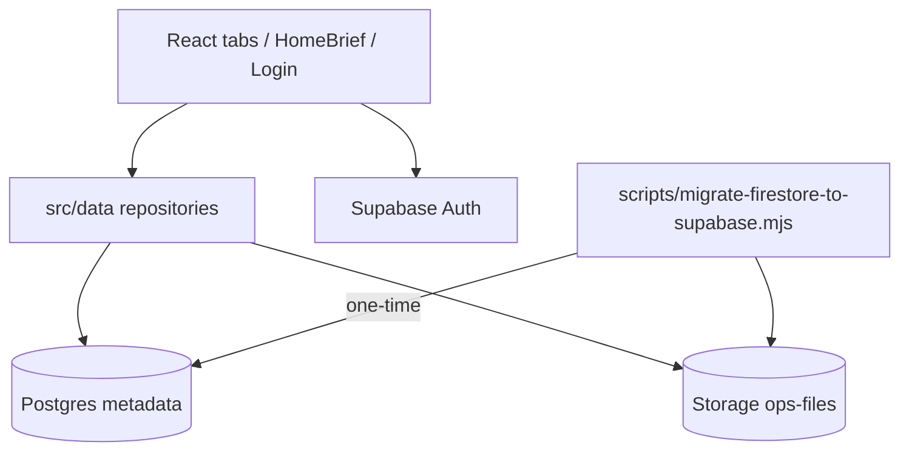
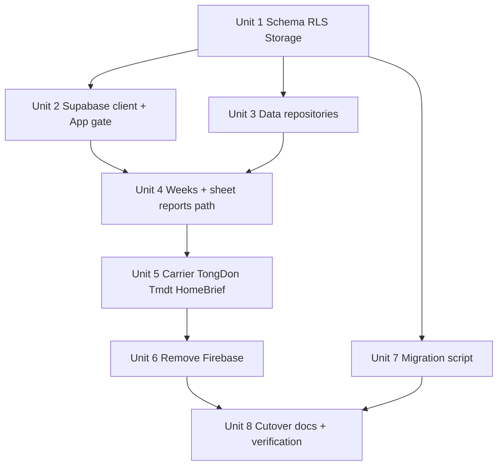

# feat: Full Firebase → Supabase migration

## Overview

Replace Firebase Auth + Firestore `kvstore` sync with **Supabase Auth**, **Postgres (relational)**, and **Storage** for CPC1HN delivery reporting. After cutover the app is **cloud-first** and **online-only**, shared across all signed-in operators, with historical Firestore data migrated once. Production downtime until go-live is accepted; do **not** restore hardcoded Firebase keys or patch `VITE_FIREBASE_*` as a temporary fix (see origin).

## Problem Frame

Today every `localStorage` write is monkey-patched to Firestore (`src/cloudSync.js`), and login uses Firebase email/password (`src/firebase.js`, `src/components/Login.jsx`). That model is hard to secure/configure on Vercel after env extraction, and it blocks a cleaner data model. The product decision is a full backend swap while **preserving business rules** in `CONTEXT.md` (weekId semantics, delivery buckets, carrier rules, report formulas).

## Requirements Trace

- **R1–R2:** Big-bang remove Firebase; no Firebase production bandage.
- **R3:** Preserve report/carrier/week business behavior; change persistence only.
- **R4–R6:** Supabase email/password auth; recreate users manually; clean logout/session.
- **R7:** Shared org data for any authenticated user (not per-uid isolation).
- **R8–R10:** Relational schema + Storage for Excel/detail payloads; no `localStorage` source of truth; delete kvstore-style sync.
- **R11–R12:** Online-only hard gate; no silent local fallback.
- **R13–R15:** One-time Firestore migrate + cutover checklist.
- **R16–R18:** Vite env for Supabase; RLS; service role only in offline migrate script.

## Scope Boundaries

- No dual-write Firebase+Supabase after go-live.
- No org/roles admin UI; no offline queue; no formula changes.
- No “perfect” normalization of every historical override key — first-class tables for weeks/reports/carriers; residual small keys may live in a constrained settings table.
- No shipping `service_role` in the web bundle.

## Context & Research

### Relevant Code and Patterns

- Auth shell state machine: `src/App.jsx` (`checking | loggedOut | syncing | ready`) — remap `syncing` to “loading cloud workspace”.
- Login UI to keep: `src/components/Login.jsx` + login tokens in `src/index.css`.
- Persistence hotspots: `src/useWeeklyData.js`, `src/utils/sheetReports.js`, `src/components/CarrierStats.jsx`, `src/components/TongDonTab.jsx`, `src/components/TmdtTab.jsx`, `src/components/HomeBrief.jsx`, override helpers in `ThongKeGiaoHang.jsx` / `ThongKeDoiTac.jsx` / `SheetReportPanel.jsx`.
- Current cloud: `src/cloudSync.js` (chunked Firestore docs) — migration must reassemble chunks.
- Tests to extend/replace mocks: `src/components/__tests__/App.characterization.test.jsx`, `src/firebase.test.jsx` → Supabase equivalents.
- Deploy: Vite + Vercel (`huyenduongwebapp`); also GitHub Pages workflow noted in `CONTEXT.md` — both need Supabase env if still used.

### Institutional Learnings

- No `docs/solutions/` yet; `CONTEXT.md` is the binding ops contract: week-scoped keys, no cross-week overwrite, carrier week independence, tongdon snapshot immutability after save.

### External References

- [Supabase React tutorial](https://supabase.com/docs/guides/getting-started/tutorials/with-react) — client auth + RLS mindset.
- Supabase Storage + `storage.objects` policies for authenticated shared-org access (private bucket, allow any `authenticated` role for v1 shared store).

## Key Technical Decisions

- **Single Supabase project / single shared org:** one bucket `ops-files`, all authenticated users full CRUD (mirrors old Firestore rules) (see origin R7).
- **Split data plane:** metadata + frozen aggregates in Postgres; raw week/carrier row dumps as JSON (or original file) in Storage; DB row holds `storage_path` (see origin R9).
- **Repository layer:** introduce `src/data/*` accessors used by hooks/components so UI does not call Supabase ad hoc in every file.
- **Residual settings table:** `ops_settings(key text primary key, value jsonb, updated_at)` for dynamic override keys (`chuagiao_*`, `tongdon_field_*`, excludes, picks, pending_clear, etc.) instead of dozens of micro-tables in v1.
- **Bootstrap gate in App:** missing env → config alert; offline/Supabase health fail → blocking error; no auth → Login; then load workspace snapshot/metadata before rendering tabs.
- **Migration = Node script offline** with Firebase Admin (or REST export) + Supabase service role; never imported by Vite app.
- **Auth users:** manual create in Supabase dashboard (see origin R5); disable email confirm for internal ops if needed so login works immediately.
- **Execution posture:** characterization-first around App auth/bootstrap; external-delegate friendly units for Codex.

## Open Questions

### Resolved During Planning

- **Page-level week model:** Keep per-channel active week rows; no new global week picker (consistent with HomeBrief brainstorm).
- **RLS shape for shared org:** `TO authenticated USING (true) WITH CHECK (true)` on org tables + matching Storage policies for bucket `ops-files` (v1).
- **Where Excel lives:** Storage object per week/carrier entry; path convention `weeks/{channel}/{weekId}.json` and `carriers/{carrierKey}/{weekId}.json`.

### Deferred to Implementation

- Exact JSON shape stored in Storage vs re-upload original xlsx bytes (prefer JSON rows already in Firestore values for fidelity to current compute path).
- Whether GitHub Pages deploy remains active alongside Vercel — implementer confirms workflows and documents env for each.
- Precise row counts / empty-key cleanup during migrate (discover from live Firestore dump).

## High-Level Technical Design

> *Directional guidance for review, not implementation specification.*

**Suggested tables (names indicative):**

| Table | Purpose |
|---|---|
| `report_weeks` | Đơn C/DTP week metadata + `storage_path` + `is_active` |
| `sheet_reports` | Frozen sheet snapshots (b24/b48/b72, carrier links, …) |
| `tongdon_reports` | Saved tongdon snapshots (jsonb payload) |
| `tmdt_reports` | Saved TMĐT snapshots |
| `carrier_weeks` | Carrier week metadata + `storage_path` + active flags |
| `carrier_hold_weeks` | Hold-week metadata + storage |
| `ops_settings` | Residual key/value jsonb for overrides & UI prefs |

**App state after login:** repositories load metadata lists; opening a week fetches Storage JSON into memory for calculations (same row shape `useWeeklyData` expects today).

## Implementation Units

- [ ] **Unit 1: Supabase schema, RLS, Storage bucket**

**Goal:** Durable SQL migration files defining relational tables, shared-org RLS, and private `ops-files` bucket policies.

**Requirements:** R7, R8, R9, R17

**Dependencies:** Supabase project created by ops (URL/keys available to implementer)

**Files:**
- Create: `supabase/migrations/20260809_init_ops_schema.sql`
- Create: `supabase/README.md` (how to apply migration)
- Modify: `.env.example`

**Approach:**
- Encode tables above with indexes on channel/type and updated_at.
- Enable RLS; authenticated full access; deny anon.
- Private storage bucket `ops-files` with authenticated read/write/delete.

**Execution note:** external-delegate

**Test scenarios:**
- Happy path: SQL applies cleanly on empty project
- Edge case: re-apply / idempotency notes documented if using `IF NOT EXISTS`
- Error path: anon key cannot select org tables (verify via policy intent in README)

**Verification:** Migration SQL reviewed; `.env.example` lists `VITE_SUPABASE_URL`, `VITE_SUPABASE_ANON_KEY`; service role documented as migrate-only.

- [ ] **Unit 2: Supabase client, auth session, online-only App gate**

**Goal:** Replace Firebase bootstrap with Supabase client + config/offline/login gates; keep CPC1HN login visuals.

**Requirements:** R4, R6, R11, R16

**Dependencies:** Unit 1 (env names); can stub schema for auth-only smoke

**Files:**
- Create: `src/supabase.js` (or `src/lib/supabaseClient.js`)
- Modify: `src/App.jsx`
- Modify: `src/components/Login.jsx`
- Create: `src/supabase.test.jsx`
- Modify: `src/components/__tests__/App.characterization.test.jsx`
- Delete or stop using: `src/firebase.js` (final delete in Unit 6 if still needed as shim temporarily — prefer direct swap)

**Approach:**
- Mirror current missing-env UX pattern already added for Firebase.
- `onAuthStateChange` → loggedOut/ready; insert explicit online check before workspace.
- Login: `signInWithPassword`; logout: `signOut`.
- Map old `syncing` to loading cloud metadata (may complete fully in Unit 4).

**Execution note:** characterization-first + external-delegate

**Test scenarios:**
- Happy path: valid session renders shell heading Trang chủ
- Error path: missing env shows config alert listing keys
- Error path: offline/health failure shows Vietnamese blocking state (mock)
- Happy path: login success transitions out of Login
- Integration: logout returns to Login and clears session mock

**Verification:** App no longer calls `onAuthStateChanged` from `firebase/auth`.

- [ ] **Unit 3: Data repositories (Postgres + Storage)**

**Goal:** Central read/write API for weeks, reports, carriers, settings, and Storage upload/download.

**Requirements:** R8, R9, R10, R12, R18

**Dependencies:** Unit 1

**Files:**
- Create: `src/data/reportWeeks.js`
- Create: `src/data/sheetReports.js`
- Create: `src/data/tongdonReports.js`
- Create: `src/data/tmdtReports.js`
- Create: `src/data/carrierWeeks.js`
- Create: `src/data/opsSettings.js`
- Create: `src/data/storageFiles.js`
- Create: `src/data/__tests__/reportWeeks.test.js` (and/or one repository suite with mocks)

**Approach:**
- Each module returns domain objects close to today’s in-memory shapes to minimize formula churn.
- Uploading a week: write Storage object then upsert metadata row (document failure/rollback strategy simply: delete storage if DB fails or mark orphan for later cleanup).
- Settings: get/set/remove by string key.

**Execution note:** external-delegate; test-first for repository helpers with mocked supabase client

**Test scenarios:**
- Happy path: save week metadata + path round-trips
- Happy path: settings set/get/remove
- Edge case: missing storage object → clear error, no crash
- Error path: supabase error surfaced to caller (no silent empty success)

**Verification:** No repository imports `firebase`; no `localStorage` writes inside repositories.

- [ ] **Unit 4: Wire Đơn C/DTP week lifecycle + sheet reports**

**Goal:** `useWeeklyData` / sheet report flows read-write Supabase instead of localStorage.

**Requirements:** R3, R8, R9, R10

**Dependencies:** Units 2–3

**Files:**
- Modify: `src/useWeeklyData.js`
- Modify: `src/utils/sheetReports.js`
- Modify: `src/components/SheetTab.jsx` (only if persistence calls need await/loading UX)
- Modify: related tests under `src/components/__tests__/` / new hook tests
- Modify: `src/components/HomeBrief.jsx` status reads (partial OK here or Unit 5)

**Approach:**
- Preserve weekId generation and prune/pending-clear *behavior*; persist pending-clear via `ops_settings` if still required.
- When active week selected, fetch Storage JSON into hook state for calculations.
- Sheet report freeze writes `sheet_reports` row; do not keep parallel localStorage copy as source of truth.

**Execution note:** external-delegate; characterization of upload → active week → save report path

**Test scenarios:**
- Happy path: add week → appears in list → active selection loads rows
- Happy path: save sheet report → HomeBrief/ready state can see frozen headline fields
- Edge case: week metadata exists but storage missing → user-visible error
- Integration: two sequential saves do not corrupt other channel’s weeks

**Verification:** `weeks_donC` / `sheet_reports_donC` localStorage keys no longer required for happy path.

- [ ] **Unit 5: Carrier, Tổng đơn, TMĐT, overrides, HomeBrief**

**Goal:** Remaining persistence surfaces use repositories; HomeBrief derives status from Supabase-backed data.

**Requirements:** R3, R8, R10

**Dependencies:** Unit 4

**Files:**
- Modify: `src/components/CarrierStats.jsx`
- Modify: `src/components/TongDonTab.jsx`
- Modify: `src/components/TmdtTab.jsx`
- Modify: `src/components/ThongKeGiaoHang.jsx`
- Modify: `src/components/ThongKeDoiTac.jsx`
- Modify: `src/components/SheetReportPanel.jsx`
- Modify: `src/components/HomeBrief.jsx`
- Modify: `src/components/__tests__/App.characterization.test.jsx`
- Modify: `src/components/__tests__/SheetReportPanel.test.jsx`

**Approach:**
- Replace direct `localStorage` gets/sets with repository calls (async — add loading/error affordances minimal but explicit).
- Tongdon/Tmdt saved snapshots → jsonb columns.
- Overrides → `ops_settings`.
- HomeBrief: read metadata/reports from repositories (or a thin `src/data/homeBrief.js` aggregator) instead of parsing localStorage.

**Execution note:** external-delegate

**Test scenarios:**
- Happy path: tongdon save → reload session still shows snapshot
- Happy path: tmdt report list persists
- Happy path: HomeBrief exceptions/actions match missing vs saved states
- Edge case: malformed remote settings value treated as empty, no crash
- Integration: App characterization updated to mock Supabase data layer not localStorage kv

**Verification:** Grep of `src/` shows no production persistence via `localStorage.setItem` for report domain keys (session-only UI prefs if any must be justified in PR notes).

- [ ] **Unit 6: Remove Firebase dependency and dead sync**

**Goal:** Delete Firebase client usage and package dependency; App/Login fully Supabase.

**Requirements:** R1, R10

**Dependencies:** Units 2–5

**Files:**
- Delete: `src/firebase.js`, `src/firebase.test.jsx`, `src/cloudSync.js`
- Modify: `package.json` / lockfile (remove `firebase`)
- Modify: `CONTEXT.md`
- Modify: any remaining imports

**Approach:**
- Ensure no dynamic import left; update docs that still say Firebase sync.

**Execution note:** external-delegate

**Test scenarios:**
- Integration: vitest suite passes without firebase mocks except historical none
- Error path: build succeeds without firebase package

**Verification:** `npm ls firebase` empty; app boots with Supabase only.

- [ ] **Unit 7: One-time Firestore → Supabase migration script**

**Goal:** Offline script reassembles chunked `kvstore`, maps keys into tables + Storage, prints verification counts.

**Requirements:** R13, R14, R18

**Dependencies:** Unit 1; read access to Firestore project `huyen-duong-cpc1hn`

**Files:**
- Create: `scripts/migrate-firestore-to-supabase.mjs`
- Create: `scripts/README-migrate.md`
- Optional: `scripts/fixtures/` small synthetic kvstore sample for dry-run

**Approach:**
- Read all `kvstore` docs; join `__chunk*` payloads.
- Map known prefixes (`weeks_*`, `sheet_reports_*`, `tongdon_reports`, `tmdt_reports`, `carrier_*`, etc.) to repositories’ target shapes.
- Unknown keys → `ops_settings` (or log + quarantine list).
- Idempotent-ish upserts by stable ids; dry-run flag.
- Use service role env vars only in script process env.

**Execution note:** external-delegate

**Test scenarios:**
- Happy path: fixture with chunked week key lands as metadata + storage object
- Edge case: orphan chunk without parent logged, not crashing
- Error path: missing service role aborts with clear message
- Integration: count report — N weeks / M reports printed at end

**Verification:** Dry-run against fixture succeeds; live run instructions documented for anh (credentials never committed).

- [ ] **Unit 8: Cutover runbook + production verification**

**Goal:** Operator checklist to create users, set Vercel env, migrate, deploy, verify multi-machine, decommission Firebase.

**Requirements:** R2, R5, R15, R16

**Dependencies:** Units 6–7

**Files:**
- Create: `docs/runbooks/2026-08-09-supabase-cutover.md`
- Modify: `CONTEXT.md`
- Modify: `.env.example` if needed

**Approach:**
- Ordered steps: Supabase project → apply SQL → bucket → create users → migrate → Vercel env → deploy → QA matrix → disable Firebase API keys/project later.
- Explicit note: do not set Firebase env; downtime until this completes.

**Test scenarios:**
- Test expectation: none for code — runbook completeness review
- Manual verification list embedded (login, upload week, second browser sees data, offline blocked, HomeBrief status)

**Verification:** Runbook exists and `CONTEXT.md` no longer documents Firestore kvstore as live path.

## System-Wide Impact

- **Interaction graph:** App auth gate → repositories → every report tab + HomeBrief + sidebar logout; migration script independent.
- **Error propagation:** Repository errors bubble to UI toasts/banners; bootstrap failures block workspace (online-only).
- **State lifecycle risks:** Storage written without DB row (orphans); mitigate with ordered writes + migrate verification; pending-clear timers must not assume local-only.
- **API surface parity:** GitHub Pages and Vercel both need Supabase env if both stay active.
- **Integration coverage:** Multi-tab/multi-machine shared org; HomeBrief + sheet save path; login/logout.
- **Unchanged invariants:** Delivery day rules, partnerType, carrier status classification, n8n form business fields, weekId meaning.

## Alternative Approaches Considered

- **kvstore table 1:1 on Postgres:** Rejected — origin chose relational.
- **Keep localStorage source of truth + sync:** Rejected — origin chose cloud-first.
- **Per-user RLS:** Rejected — origin chose shared org.
- **Patch Firebase on Vercel first:** Rejected — origin accepted downtime.

## Success Metrics

- Production login works with Supabase users.
- Migrated weeks/reports visible after cutover.
- Second machine sees writes without manual localStorage copy.
- Offline cannot enter workspace.
- `firebase` absent from production bundle dependencies.

## Dependencies / Prerequisites

- Anh creates Supabase project and operator users (or supplies access).
- Firestore read credentials for one-time migrate.
- Vercel project env update + redeploy access.
- Accept continued downtime until Unit 8 completes.

## Risk Analysis & Mitigation

| Risk | Likelihood | Impact | Mitigation |
|------|-----------|--------|------------|
| Incomplete key mapping loses overrides | Med | High | Quarantine unknown keys to `ops_settings` + migrate report |
| Large Storage downloads slow tab open | Med | Med | Lazy-load week payload only when selected; keep metadata list light |
| Async refactor breaks sync UI assumptions | High | Med | Minimal loading/error states; characterization tests on critical flows |
| Service role leaked to frontend | Low | Critical | Script-only env; code review grep |
| GitHub Pages ships without env | Med | High | Document both hosts; fail loud on missing env |

## Phased Delivery

### Phase A — Platform
Units 1–3 (schema, auth gate, repositories)

### Phase B — App persistence
Units 4–6 (wire tabs, remove Firebase)

### Phase C — Data + go-live
Units 7–8 (migrate, cutover, verify)

## Documentation Plan

- Update `CONTEXT.md` cloud section to Supabase.
- Add `docs/runbooks/2026-08-09-supabase-cutover.md`.
- Keep origin requirements as product contract.

## Operational / Rollout Notes

1. Freeze writes on old Firebase mentally (site already down).
2. Apply SQL + create users.
3. Run migrate; spot-check counts.
4. Set Vercel `VITE_SUPABASE_*`; redeploy.
5. QA two browsers + offline.
6. Remove Firebase app keys from client configs; schedule Firebase project disable after confidence window.

## Sources & References

- **Origin document:** [docs/brainstorms/2026-08-09-full-supabase-migration-requirements.md](docs/brainstorms/2026-08-09-full-supabase-migration-requirements.md)
- Related code: `src/cloudSync.js`, `src/App.jsx`, `src/useWeeklyData.js`, `src/components/Login.jsx`
- External: [Supabase with React](https://supabase.com/docs/guides/getting-started/tutorials/with-react)
