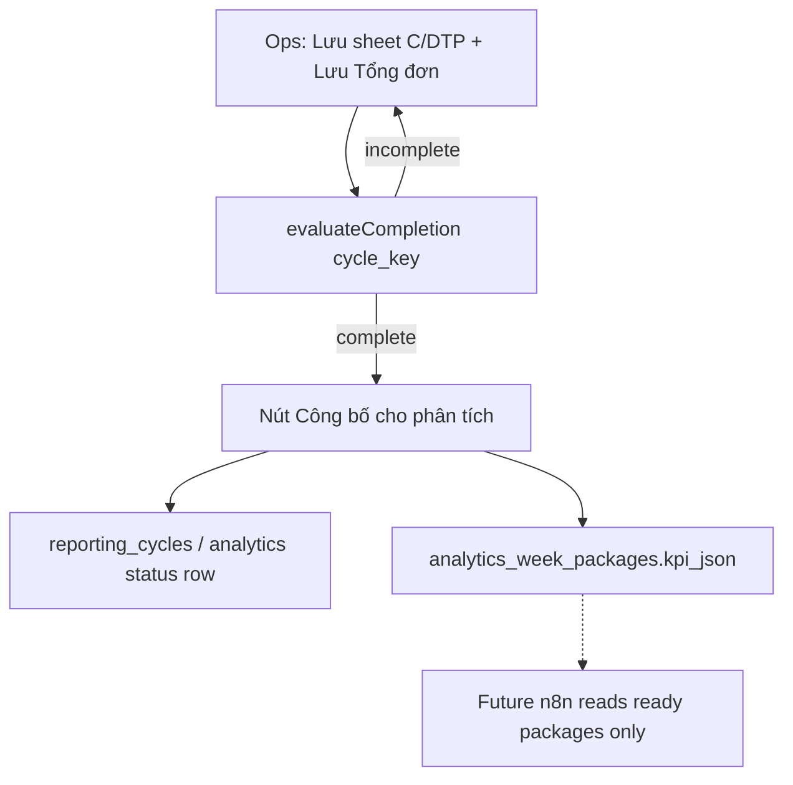
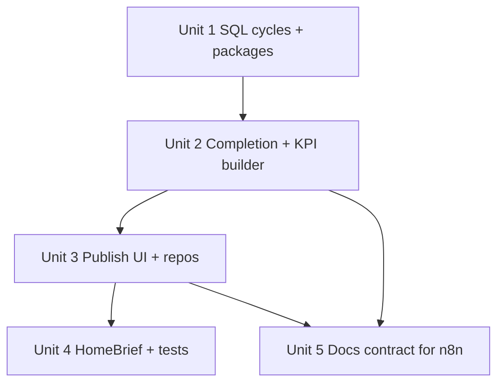

# feat: Webapp-first analytics foundation

## Overview

After successful Supabase cutover (Vercel + operator login), add a **completion gate** so only reporting cycles that ops finished in the Web App become `ready_for_analytics` on Supabase, and materialize a **weekly KPI JSON package** for the future n8n/AI Saturday job. No LLM, PNG, or chat bots in this epic (see origin R10).

## Problem Frame

AI Ops design doc assumes n8n can `SELECT get_weekly_kpi_report()` from a `don_hang` table. Real CPC1HN flow finishes numbers in the Web App (upload → reconcile → **Lưu số liệu / Lưu báo cáo**), then persists via `opsStore` to Supabase. Without an explicit gate, analytics could read incomplete work. This plan locks the gate and a KPI package derived from **completed** app artifacts (see origin R1–R8).

## Requirements Trace

- **R1–R3:** Webapp remains source of completion; preserve business rules.
- **R4–R6:** Definable completion checklist + `ready_for_analytics` flag; incomplete cycles stay editable, excluded from analytics consumers.
- **R7–R8:** Choose analytics shape **7b — KPI JSON package** (not full `don_hang` rows in this epic); SQL/API must use real tables.
- **R9–R11:** Foundation only; n8n/AI/PNG deferred; design doc remains north star.
- **R12–R13:** Cutover assumed done; shared-org access continues.

## Scope Boundaries

- No n8n schedule, Gemini/OpenAI, PNG render, Telegram/Zalo.
- No rewrite of SLA/carrier formulas; reuse numbers already frozen in sheet/tongdon/tmdt snapshots where possible.
- No mandatory backfill of every historical week; optional backfill only for cycles that already satisfy the gate.
- No per-user data split.

## Context & Research

### Relevant Code and Patterns

- Persistence adapter: `src/data/workspace.js` (`opsStore`) + repos under `src/data/`.
- Sheet freeze: `src/utils/sheetReports.js` → `sheet_reports` (+ payload aggregates b24/b48/b72…).
- Tongdon lock: `src/components/TongDonTab.jsx` `saveReport` → `tongdon_reports` payload includes `weekKey`, `current`, verdict, etc.
- TMĐT: `src/components/TmdtTab.jsx` → `tmdt_reports`.
- Home readiness UX already mirrors “saved vs missing”: `src/components/HomeBrief.jsx`.
- Schema baseline: `supabase/migrations/20260809_init_ops_schema.sql` (+ grants).
- Ops contract: `CONTEXT.md`.

### Institutional Learnings

- Week-scoped keys and “Lưu số liệu tuần này” freeze semantics must not be broken.
- Tongdon keeps a single latest saved report in current product behavior — planning must treat **cycle identity** carefully (`weekKey` inside payload).

### External References

- Internal design brief (user download): AI Ops Kho HCM — KPI formulas, Saturday 08:00, LLM prompt structure (phase-after).

## Key Technical Decisions

- **Completion gate (R4) — locked for this plan:**
  A cycle is complete when **all** hold:
  1. `sheet_reports` exists for `donC` and `donDTP` for the two week ids encoded in tongdon `weekKey` (`{donCId}_{donDTPId}`), **or** if product later stores explicit ids on the cycle row — implementer must parse `payload.weekKey` consistently with `TongDonTab`.
  2. A `tongdon_reports` row exists whose `payload.weekKey` matches that pair (saved/locked tongdon).
  3. **Soft/optional for v1 gate:** at least one `tmdt_reports` overlapping the cycle’s date span if present in ops practice; **do not block** `ready_for_analytics` on TMĐT in v1 (document as follow-up), unless implementer finds tongdon always requires TMĐT totals — then elevate to required after verifying UI.
- **Analytics shape = 7b KPI package:** table `analytics_week_packages` (name indicative) storing `cycle_key`, `status`, `kpi_json`, `source_refs`, timestamps. Prefer assembling KPI from frozen tongdon/sheet/carrier payloads over re-parsing Excel.
- **Publish action:** explicit **“Công bố cho phân tích”** (or equivalent) on Tongdon (or HomeBrief) after prerequisites met — sets status `ready_for_analytics` and upserts KPI package. Auto-publish on every save is rejected (too easy to mark incomplete work ready).
- **Unpublish/rework:** if tongdon delete/re-save allowed, status returns to `draft` and package marked stale; mirror existing destructive confirmations.
- **No `don_hang` in this epic:** defer row-level warehouse to a later plan if AI needs drill-down beyond KPI JSON.
- **Execution posture:** characterization around tongdon save + new publish; Claude Code as implementer (`Execution target: external-delegate`).

## Open Questions

### Resolved During Planning

- Cutover complete enough to start foundation (user confirmed Vercel + Supabase login).
- Choose **7b KPI JSON** over **7a don_hang** for this epic.
- Gate requires sheet C+DTP + tongdon save; TMĐT not hard-required in v1.
- Publish is explicit, not implicit on save.

### Deferred to Implementation

- Exact KPI field mapping from tongdon `current` / sheet payload / carrier frozen stats → document JSON schema in `docs/` or SQL comment.
- Whether HomeBrief shows “Sẵn sàng phân tích” badge.
- Optional one-off backfill script for already-saved tongdon rows that meet the gate.

## High-Level Technical Design

> *Directional guidance, not implementation specification.*

**Indicative tables**

| Table | Role |
|---|---|
| `reporting_cycles` | `cycle_key` (= tongdon `weekKey`), `status` (`draft` \| `ready_for_analytics`), `tongdon_report_id`, timestamps, `published_by` |
| `analytics_week_packages` | `cycle_key` PK/FK, `kpi_json` jsonb, `source_refs` jsonb, `built_at` |

**KPI JSON (contract sketch for later AI):** period labels, totals, sla_24h_pct, return_rate_pct, wip_pct if derivable, wow_pct vs previous saved cycle if available, channel/partner breakdowns from existing frozen structures — **no new business formulas** if numbers already exist on snapshots; if a field cannot be derived safely, omit and document rather than invent.

## Implementation Units

- [ ] **Unit 1: Schema for cycles + KPI packages**

**Goal:** Add Supabase migration with RLS/grants consistent with existing shared-org pattern.

**Requirements:** R5, R7b, R8, R13

**Dependencies:** Existing init migration applied in project

**Files:**
- Create: `supabase/migrations/20260809_analytics_foundation.sql`
- Modify: `supabase/README.md`

**Approach:**
- Create `reporting_cycles` and `analytics_week_packages`.
- Enable RLS; `authenticated` full access; grants for `anon/authenticated/service_role` like prior grant fix.
- No n8n-facing SECURITY DEFINER yet unless needed for read RPC later (optional thin `get_ready_analytics_packages()` returning only `ready_for_analytics`).

**Execution note:** external-delegate (Claude Code)

**Test scenarios:**
- Happy path: SQL applies on project that already has init schema
- Edge case: re-run idempotent where practical
- Error path: anon cannot read packages (policy intent documented)

**Verification:** Tables visible in Supabase; grants present.

- [ ] **Unit 2: Completion evaluator + KPI package builder**

**Goal:** Pure functions/modules that decide gate pass/fail and build `kpi_json` from frozen payloads.

**Requirements:** R3, R4, R7b, R8

**Dependencies:** Unit 1 (types/shape only); can unit-test without UI

**Files:**
- Create: `src/analytics/completionGate.js`
- Create: `src/analytics/buildWeekKpiPackage.js`
- Create: `src/analytics/__tests__/completionGate.test.js`
- Create: `src/analytics/__tests__/buildWeekKpiPackage.test.js`

**Approach:**
- Input: tongdon payload + sheet reports C/DTP (+ optional tmdt/carrier).
- Output: `{ ok, missing: string[], cycleKey }` and `{ kpi_json, source_refs }`.
- Prefer reading aggregates already on snapshots; do not reimplement deliveryDays unless unavoidable.

**Execution note:** test-first + external-delegate

**Test scenarios:**
- Happy path: both sheets + tongdon weekKey → ok
- Edge case: missing donDTP sheet → ok false with clear missing code
- Edge case: tongdon without weekKey → fail safe
- Happy path: KPI json contains period + sla/return fields when present on sources
- Edge case: missing optional field omitted, not zero-faked

**Verification:** Vitest coverage for gate and builder.

- [ ] **Unit 3: Repositories + Công bố UI on Tongdon**

**Goal:** Wire publish/unpublish to Supabase; UI only enabled when gate passes.

**Requirements:** R1, R5, R6, R9

**Dependencies:** Units 1–2

**Files:**
- Create: `src/data/reportingCycles.js`
- Create: `src/data/analyticsPackages.js`
- Modify: `src/components/TongDonTab.jsx`
- Modify: `src/data/workspace.js` only if load/publish cache needs awareness (prefer dedicated repos + refresh)
- Test: `src/components/__tests__/TongDonPublish.test.jsx` (or extend characterization carefully)

**Approach:**
- After tongdon is saved/locked for `weekKey`, show **Công bố cho phân tích** when `completionGate` passes.
- On publish: upsert cycle `ready_for_analytics` + package row.
- On tongdon delete: revert cycle to draft / delete package or mark `stale`.
- Vietnamese copy; disabled button with tooltip listing `missing` items.

**Execution note:** external-delegate

**Test scenarios:**
- Happy path: publish succeeds and repo called with ready status
- Error path: cloud error surfaces (reuse ops-store-error or inline alert)
- Edge case: button disabled when sheet missing
- Integration: publish then reload workspace still shows ready state

**Verification:** Manual QA on production project after migration apply.

- [ ] **Unit 4: HomeBrief status + regression**

**Goal:** Surface analytics readiness without cluttering home into a second dashboard.

**Requirements:** R6, R9

**Dependencies:** Unit 3

**Files:**
- Modify: `src/components/HomeBrief.jsx`
- Modify: `src/components/__tests__/App.characterization.test.jsx` as needed
- Modify: `src/index.css` minimally if new badge styles required

**Approach:**
- One line/badge: “Chu kỳ hiện tại: sẵn sàng phân tích” vs “Chưa công bố”.
- Do not add charts.

**Execution note:** external-delegate

**Test scenarios:**
- Happy path: ready cycle shows ready copy
- Happy path: draft/missing shows not ready
- Integration: existing HomeBrief channel cards still work

**Verification:** Characterization tests updated/passing.

- [ ] **Unit 5: Analytics contract doc for future n8n**

**Goal:** Document how phase-after n8n should read only ready packages.

**Requirements:** R10, R11

**Dependencies:** Units 2–3 (final JSON shape)

**Files:**
- Create: `docs/contracts/2026-08-09-weekly-kpi-package.md`
- Modify: `docs/brainstorms/2026-08-09-ai-ops-webapp-first-foundation-requirements.md` next steps
- Modify: `CONTEXT.md` short pointer

**Approach:**
- Describe table/RPC, status enum, example `kpi_json`, explicit non-goals (no LLM here).
- Point to Saturday 08:00 design doc as next epic.

**Test expectation:** none — doc review

**Verification:** Contract readable by someone configuring n8n later.

## System-Wide Impact

- **Interaction graph:** Tongdon save/publish → analytics tables; HomeBrief reads cycle status; future n8n reads packages only.
- **Error propagation:** Publish failures must not corrupt tongdon snapshot.
- **State lifecycle:** Delete tongdon / change weekKey must invalidate ready status.
- **Unchanged invariants:** Sheet/tongdon business calculations, auth, opsStore week uploads.

## Alternative Approaches Considered

- **Auto-ready on tongdon save:** Rejected — incomplete adjacent channels risk.
- **don_hang ETL now:** Deferred — high cost; KPI package unblocks AI Ops design sooner.
- **n8n reads raw tongdon_reports:** Rejected — no completion gate.

## Success Metrics

- Ops can publish a finished cycle; Supabase shows `ready_for_analytics`.
- Incomplete cycle cannot publish (UI + server-side check).
- KPI package present for ready cycles; absent/stale otherwise.
- No LLM/PNG/chat shipped.

## Dependencies / Prerequisites

- Production Web App on Supabase auth working (done).
- Ability to run a new SQL migration in Supabase SQL Editor.
- Claude Code session in repo with network for install/test as needed.

## Risk Analysis & Mitigation

| Risk | Likelihood | Impact | Mitigation |
|------|-----------|--------|------------|
| weekKey parse ambiguity | Med | High | Single helper shared with Tongdon; tests with real-shaped fixtures |
| KPI field gaps vs AI design doc | Med | Med | Omit unsafe fields; contract lists gaps |
| Publish without awaiting opsStore sync | Med | Med | Await tongdon persistence / read-after-write from Supabase repos |
| Scope creep into n8n | Med | Med | Unit 5 docs only; refuse chat/PNG in PR |

## Phased Delivery

### Phase 1
Units 1–2 (schema + pure logic)

### Phase 2
Units 3–4 (UI + HomeBrief)

### Phase 3
Unit 5 (contract) → handoff to future AI Ops n8n plan

## Documentation Plan

- `docs/contracts/2026-08-09-weekly-kpi-package.md`
- Short `CONTEXT.md` note under cloud/analytics
- Update origin brainstorm next steps when done

## Operational / Rollout Notes

1. Apply `20260809_analytics_foundation.sql` in Supabase SQL Editor.
2. Deploy Web App build with publish UI.
3. Ops: finish one real week → Công bố → verify row in Table Editor.
4. Do **not** point n8n at draft data.
5. Next epic: n8n Saturday job consuming `ready_for_analytics` packages only.

## Sources & References

- **Origin:** [docs/brainstorms/2026-08-09-ai-ops-webapp-first-foundation-requirements.md](docs/brainstorms/2026-08-09-ai-ops-webapp-first-foundation-requirements.md)
- Related: `src/components/TongDonTab.jsx`, `src/utils/sheetReports.js`, `src/data/workspace.js`, `supabase/migrations/20260809_init_ops_schema.sql`
- Future: AI Ops design doc (Kho HCM) — KPI formulas / prompt / T7 08:00
